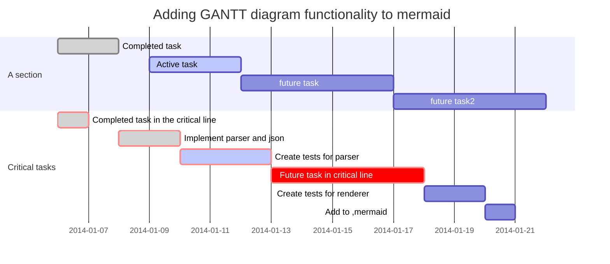

# falin_repos

my repository

### linux查找某个进程

```bash
jobs -l #查看当前所有的job
pgrep test.sh #查看当前叫test.sh 的进程

```

### 替换，用sed
```bash
sed -i "s/\r//" a.sh
sed -i "s/quay.io/quay-mirror.qiniu.com/" mandatory.yaml
sed '/this/d' # 去掉this
grep -Ev '^$|^#' /etc/zabbix/zabbix_agent2.conf #这里排除#开始的行，和空行， 好，打印输出
grep -Ev '^$|^#' /etc/zabbix/zabbix_server.conf

```

### 查看rpm/yum 安装记录
```bash
-f #查询文件所属软件包 rpm -qf /usr/bin/zsh 
-p #查询软件包 
-i #--install
-l #显示软件包中的文件列表 
-d #显示被标注为文档的文件列表 
-c #显示被标注为配置文件的文件列表
rpm -ql yum-config-manager 
rpm -e  zsh  #-e 卸载
journalctl -u jenkins.service #查看安装日志

```


### rpm包的命名规则解释：
```bash
eg：which-2.20-7.el7.x86_64.rpm 
 
解释：
which #代表的是软件名称 
2.20  #代表的是软件版本号
7     #代表的是发布版本号，指的是这个rpm软件包是第几次编译生成的 
el7   #代表的是企业版的7操作系统 
X86   #代表的是CPU架构 
64    #代表的是系统的位数
```

### 安装rpm软件包
```bash
-i    #install 安装软件包
-v    #输出更多的详情信息
-h    #输出哈希标记（#）
--nodeps #不验证软件的依赖
 
eg:
rpm -ivh zsh-5.0.2-7.el7.x86_64.rpm
rpm -ivh mariadb-server-5.5.35-3.el7.x86_64.rpm --nodeps
```
###　rpm 包卸载:
```bash
-e #卸载
rpm -e  zsh
```

### 重新加载配置文件
```bash
[root@centos lifalin]# rndc reload
rndc: neither /etc/rndc.conf nor /etc/rndc.key was found

```

### 写入文件

```bash
[root@centos kubeworkspace]$ cat >replica.yml <<EOF
> apiVersion: apps/v1 #版本号
> kind: ReplicaSet
> metadata:
>   name:
>   namespace:
>   labels:
>     controller: rs
> spec:
>   replicas: 3
>   selector:
>     matchLabels:
>       tier: nginx-pod
>     matchExpressions:
>       - {key: tier, operator: In, values: [nginx-pod]}
>   template: #模板， 当副本数量不足，会根据以下模板创建pod 副本
>     metadata:
>       labels:
>         app:
>         tier: nginx-pod
>     spec:
>       containers:
>       - name: nginx
>         image: nginx:1.17.1
>         ports:
>         - containerPort: 80
> EOF # 写完后回车 也就即时保存了

```

### 回显文件：cat 和nl 都可以
```bash
cat replica.yml
nl replica.yml
```

### 甘特图：

