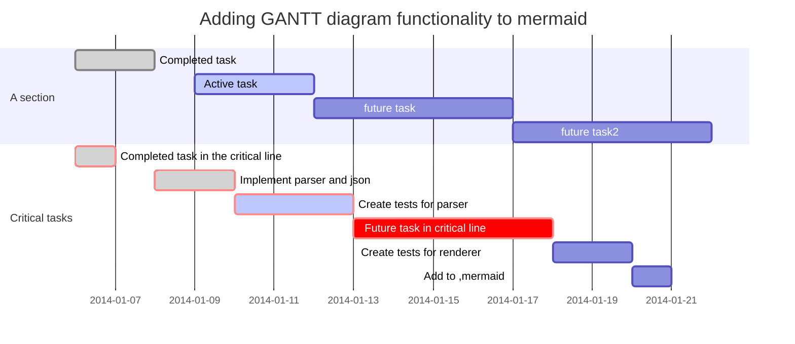

# falin_repos

my repository

### linux查找某个进程  
```bash
jobs -l #查看当前所有的job
pgrep test.sh #查看当前叫test.sh 
find / -name www.conf # find file

find / -name "*.mp4" -exec rm -rf {} \;  #找到某些文件 删除

```


### 进程通信：
```bash

mkfifo mypipe
echo "hello" > mypipe
cat < mypipe

```

### 替换，用sed
```bash
sed -i "s/\r//" a.sh
sed -i "s/quay.io/quay-mirror.qiniu.com/" mandatory.yaml
sed '/this/d' # 去掉this
grep -Ev '^$|^#' /etc/zabbix/zabbix_agent2.conf #这里排除#开始的行，和空行， 好，打印输出
grep -Ev '^$|^#' /etc/zabbix/zabbix_server.conf

grep -E 'pattern1.*pattern2' filename  #grep 本身没有and这个
egrep 'pattern1.*pattern2' filename
pgrep nginx

grep -n "^$" file1 #查询file1里面空行所在行号


$ egrep  'Tech|Sales' employee.txt  # or
100 Thomas Manager Sales $5,000
200 Jason Developer Technology $5,500
300 Raj Sysadmin Technology $7,000
500 Randy Manager Sales $6,000
=

[ -d "/path/to/dir" ] && echo "Directory /path/to/dir exists." || echo "Directory does not/path/to/dir exists." #查看某个路径是否存在

# 分别删除 创建7天前、修改7天前、访问7天前的文件。前2个用的较多。
$ find . -type f -ctime +7 -delete
$ find . -type f -mtime +7 -delete
$ find . -type f -atime +7 -delete

#vim 删除所有内容 快捷键
# gg dG
# gg 为跳转到文件首行；
# dG 为删除光标所在行以及其下所有行的内容；d为删除，G为跳转到文件末尾行；

# shell -x 调试执行
$ sh -x test.sh

```
### 基础命令：
```bash
$ mkdir -p
$ mv -f 
$ mv aa bb cc ./software #mv 多个文件
$ cp -arf
$ \\cp -f
$ ifconfig ens192   # 只显示某个网卡的信息


```


### 查看rpm/yum 安装记录
```bash
-f #查询文件所属软件包 rpm -qf /usr/bin/zsh 
-p #查询软件包 
-i #--install
-l #显示软件包中的文件列表 
-d #显示被标注为文档的文件列表 
-c #显示被标注为配置文件的文件列表
rpm -ql yum-config-manager 
rpm -e  zsh  #-e 卸载
journalctl -u jenkins.service #查看安装日志
systemctl status -l kibana 
```


### rpm包的命名规则解释：
```bash
eg：which-2.20-7.el7.x86_64.rpm 
 
解释：
which #代表的是软件名称 
2.20  #代表的是软件版本号
7     #代表的是发布版本号，指的是这个rpm软件包是第几次编译生成的 
el7   #代表的是企业版的7操作系统 
X86   #代表的是CPU架构 
64    #代表的是系统的位数
```

### 安装rpm软件包
```bash
-i    #install 安装软件包
-v    #输出更多的详情信息
-h    #输出哈希标记（#）
--nodeps #不验证软件的依赖
 
eg:
rpm -ivh zsh-5.0.2-7.el7.x86_64.rpm
rpm -ivh mariadb-server-5.5.35-3.el7.x86_64.rpm --nodeps
```
###　rpm 包卸载:
```bash
-e #卸载
rpm -e  zsh
```

### 重新加载配置文件
```bash
[root@centos lifalin]# rndc reload
rndc: neither /etc/rndc.conf nor /etc/rndc.key was found

```

### 写入文件

```bash
echo "BB" > /index.html
[root@centos kubeworkspace]$ cat >replica.yml <<EOF
> apiVersion: apps/v1 #版本号
> kind: ReplicaSet
> metadata:
>   name:
>   namespace:
>   labels:
>     controller: rs
> spec:
>   replicas: 3
>   selector:
>     matchLabels:
>       tier: nginx-pod
>     matchExpressions:
>       - {key: tier, operator: In, values: [nginx-pod]}
>   template: #模板， 当副本数量不足，会根据以下模板创建pod 副本
>     metadata:
>       labels:
>         app:
>         tier: nginx-pod
>     spec:
>       containers:
>       - name: nginx
>         image: nginx:1.17.1
>         ports:
>         - containerPort: 80
> EOF # 写完后回车 也就即时保存了

```

### 回显文件：cat 和nl 都可以
```bash
cat replica.yml
nl replica.yml
head messages -n 20
tail messages  #默认显示最后10 行
tail -f messages #实时跟进日志

head -n 10 XX.log
tail -n 10 XX.log
tail -10 XX.log
head -20 XX.log
last -n 5 

```

### shell 参数传递：
```bash
#!/bin/bash

name="Shell"
url="http://c.biancheng.net/shell/"

str1=$name$url  #中间不能有空格
str2="$name $url"  #如果被双引号包围，那么中间可以有空格
str3=$name": "$url  #中间可以出现别的字符串
str4="$name: $url"  #这样写也可以
str5="${name}Script: ${url}index.html"  #这个时候需要给变量名加上大括号

echo $str1
echo $str2
echo $str3
echo $str4
echo $str5


#/bin/bash
 
# 变量拼接
# 1. 类似字面量拼接
# part01part02
part01="part01"
part02="part02"
 
str03=${part01}${part02}
echo ${str03}
 
# 变量字面量混拼
# part01end
str04=${part01}"end"
echo ${str04}
 
# 引号
# part01 part02
str05="${part01} ${part02}"
echo ${str05}

#/bin/bash
 
# 命令
str01=`date`
# 当前日期
echo ${str01}
 
# 拼接
# 当前日期end
# 当前日期part01
part01="part01"
str02=`date`"end"
echo ${str02}
str03=`date`${part01}
echo ${str03}
 
# 引号
# 单引号内的 命令无法执行
# 当前日期
# `date`
str04="`date`"
echo ${str04}
str05='`date`'
echo ${str05}
 
```


### 甘特图：

