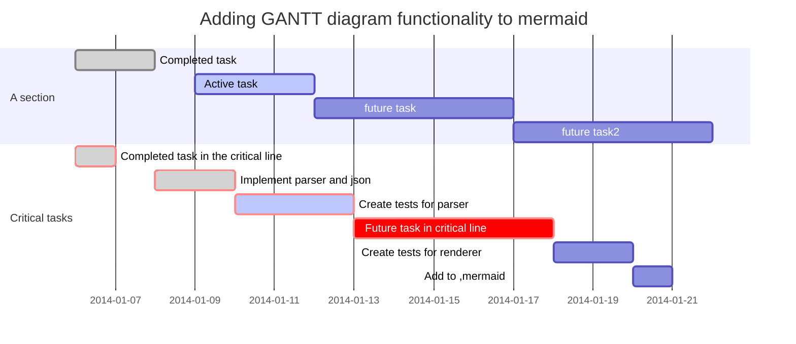

# falin_repos

my repository

### linux查找某个进程

```bash
jobs -l #查看当前所有的job
pgrep test.sh #查看当前叫test.sh 的进程

```

### 替换，用sed
```bash
sed -i "s/\r//" a.sh
sed -i "s/quay.io/quay-mirror.qiniu.com/" mandatory.yaml
```

### 查看rpm/yum 安装记录
```bash
rpm -ql yum-config-manager
```


### 写入文件

```bash
[root@centos kubeworkspace]$ cat >replica.yml <<EOF
> apiVersion: apps/v1 #版本号
> kind: ReplicaSet
> metadata:
>   name:
>   namespace:
>   labels:
>     controller: rs
> spec:
>   replicas: 3
>   selector:
>     matchLabels:
>       tier: nginx-pod
>     matchExpressions:
>       - {key: tier, operator: In, values: [nginx-pod]}
>   template: #模板， 当副本数量不足，会根据以下模板创建pod 副本
>     metadata:
>       labels:
>         app:
>         tier: nginx-pod
>     spec:
>       containers:
>       - name: nginx
>         image: nginx:1.17.1
>         ports:
>         - containerPort: 80
> EOF # 写完后回车 也就即时保存了

```

### 回显文件：cat 和nl 都可以
```bash
cat replica.yml
nl replica.yml
```

### 甘特图：

