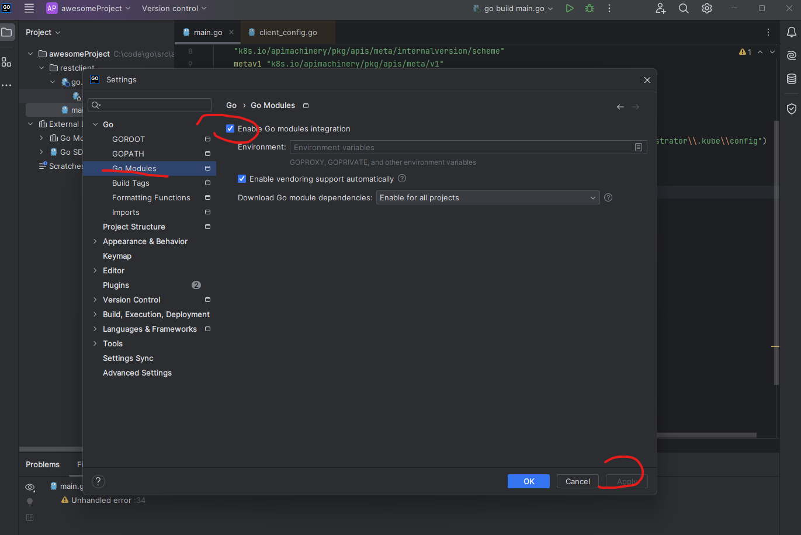

### go 常用命令
```bash

go mod init module_name
go mod tidy  # 会重新整理go.mod文件
go get k8s.io/client-go # 用于某个project 且安装到 gopath/pkg 目录下 

go install k8s.io/client-go # 适用全局 将会生成xx可执行文件在gopath/bin 目录下 xx

# vs code 调试
# get 是会安装到 go.sum 文件中，没必要。。 此处应该用install，但是install 运行失败。。
go get github.com/uudashr/gopkgs/v2/cmd/gopkgs  
go get github.com/ramya-rao-a/go-outline 
go get github.com/cweill/gotests/gotests 
go get github.com/fatih/gomodifytags 
go get github.com/josharian/impl
go get github.com/haya14busa/goplay/cmd/goplay 
go get github.com/go-delve/delve/cmd/dlv  
go get github.com/go-delve/delve/cmd/dlv@master
go get honnef.co/go/tools/cmd/staticcheck  
go get golang.org/x/tools/gopls


go run XX.go #运行S
go build xx.go  #生成xx可执行文件

go vet xx.go # 检查语法
go fmt entrance class/demo.go 
go fmt xx.go # 美化语法 格式化 format 
go doc fmt # go doc packagename, 显示fmt 包的注释，描述
go version
go env # 查看环境变量 
```


```bash

import  
corev1 k8s.io/api/core/vi 作为corev1 corev1.Affinity

#当一个模块没有的时候
go get k8s.io/api/core/vi #导入

#vscode 不能debug? 运行
go mod vendor


```


### 几个重要的文件
```bash
go.mod  是执行go init 生成的
go.sum  是在go get 时 生成的   
```
### goland 调试
```bash
go env -w GOARCH=amd64 #为goland debug 设置的
#刚导入项目 很多红线
#打开 GoLand 点击左上角： GoLand -> File -> Settings -> Go Modules
# enable go module integration
```
