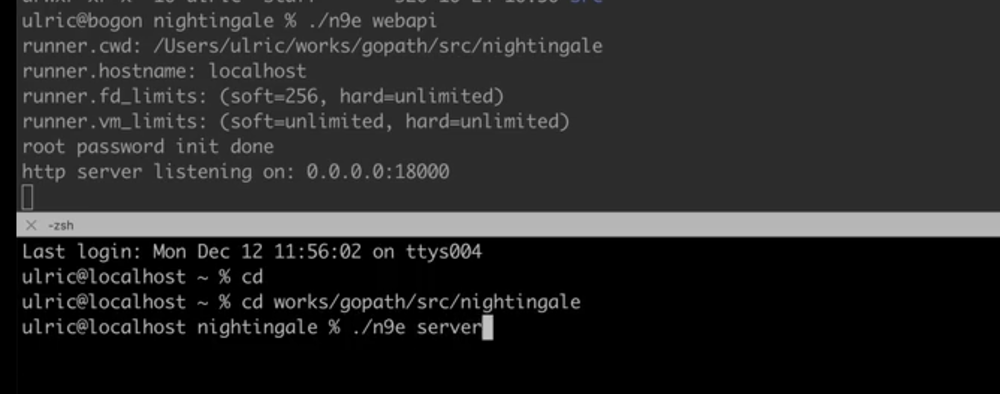

```bash
docker  run -p 3306:3306 --name mysql --restart=always  --privileged=true \
-e MYSQL_ROOT_PASSWORD=123456 -d mysql:latest

docker exec -it mysql sh

mysql -u root -p 
123456

create database devops_platform
use devops_platform

```


```bash
# copy one file from host to container 
# docker cp <host-src-path> <container-id>:<container-dest-path>
docker cp ./n9e.sql d7a28813666d:/n9e.sql 

docker exec -it d7a28813666d sh
mysql -uroot -p1234 < n9e.sql


```

访问夜莺
1. 浏览器访问夜莺的端口，即 17000，默认用户是 root，密码是 root.2020
2. if you install nightingale by binary files, you should download source code from https://github.com/ccfos/nightingale/releases,
3. pay attention to config files located in /etc/configure.toml


一共启动两个组件： n9e webapi 和 n9e server， 

./n9e webapi（cofig file located in ./etc/webapi.conf）  
./n9e server


### categraf 二进制安装
```bash
wget https://download.flashcat.cloud/categraf-v0.3.73-linux-amd64.tar.gz
tar zxvf categraf-v0.3.73-linux-amd64.tar.gz
cd categraf-v0.3.73-linux-amd64/

# start categraf as systemctl service
./categraf --install 

# check status , equivalently to systemctl status categraf
./categraf --status 

# start categraf. this moment the ./conf/config.toml could be viewed and checked
systemctl start categraf  

# for more details please check official guildline at https://flashcat.cloud/docs/content/flashcat-monitor/nightingale-v6/agent/categraf/
```


#### kitex  start for master
```bash

go install github.com/cloudwego/kitex/tool/cmd/kitex@latest
go install github.com/cloudwego/thriftgo@latest

#创建echo.thrift

kitex -module kitex -service master echo.thrift
 
go get github.com/cloudwego/kitex@latest  #为了main.go 中报错的问题
go mod tidy

# 编写handler实现部分

go run .main.go   handler.go # 启动server 

client 中引用为kitex , dest service 为master
go run client.go


```


### protobuf 安装
https://github.com/protocolbuffers/protobuf/releases 下载 protoc-27.4-win64.zip
```bash


```