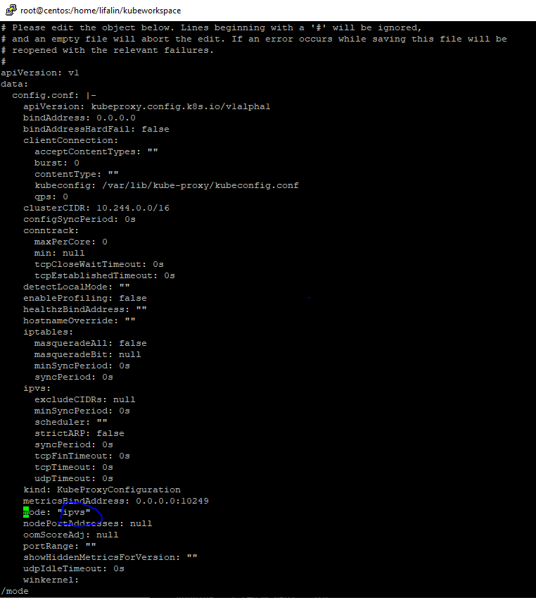

### 设置为ipvs模式
首先找到目前kube-proxy 的工作模式，
   用 ``kubectl edit ``命令

```bash
kubectl edit cm kube-proxy -n kube-system
```

将mode设置为“ipvs”（ 没改之前，默认是”“）
退出保存


### 重新配置kube-proxy为ipvs模式
删除当前的kube-proxy,
```bash
kubectl get pod -n kube-system|grep kube-proxy|awk '{system("kubectl delete pod "$1" -n kube-system")}'
```

删除后kube-proxy 会自动重新生成。生成为采用ipvs模式。
这里要说明的是，你的k8s集群有几个节点，kube-proxy 就会被删除几个，master 和node 节点上的kube-proxy 都会被删除，重生。

### 安装ipvsadm 命令工具
趁kube-proxy 重整的时间，你可以安装ipvsadm，

```bash
yum install ipvsadm -y
```

###  测试
测试ipvs模式是否work:
   用 ``ipvsadm -Ln``命令
```bash
[root@centos kubeworkspace]# ipvsadm -Ln
IP Virtual Server version 1.2.1 (size=4096)
Prot LocalAddress:Port Scheduler Flags
  -> RemoteAddress:Port           Forward Weight ActiveConn InActConn
TCP  172.17.0.1:32470 rr
  -> 172.17.0.3:80                Masq    1      0          0
  -> 172.17.0.4:80                Masq    1      0          0
TCP  172.18.0.1:32470 rr
  -> 172.17.0.3:80                Masq    1      0          0
  -> 172.17.0.4:80                Masq    1      0          0
TCP  172.19.0.1:32470 rr
  -> 172.17.0.3:80                Masq    1      0          0
  -> 172.17.0.4:80                Masq    1      0          0
TCP  192.168.5.100:32470 rr
  -> 172.17.0.3:80                Masq    1      0          0
  -> 172.17.0.4:80                Masq    1      0          0
TCP  10.96.0.1:443 rr
  -> 192.168.5.100:8443           Masq    1      0          0
TCP  10.96.0.10:53 rr
  -> 172.17.0.5:53                Masq    1      0          0
TCP  10.96.0.10:9153 rr
  -> 172.17.0.5:9153              Masq    1      0          0
TCP  10.104.59.61:80 rr
  -> 172.17.0.3:80                Masq    1      0          0
  -> 172.17.0.4:80                Masq    1      0          0
TCP  10.105.243.201:80 rr
  -> 172.17.0.3:80                Masq    1      0          0
  -> 172.17.0.4:80                Masq    1      0          0
UDP  10.96.0.10:53 rr
  -> 172.17.0.5:53                Masq    1      0          0
```

可以看到ipvs 模式已经建立。
