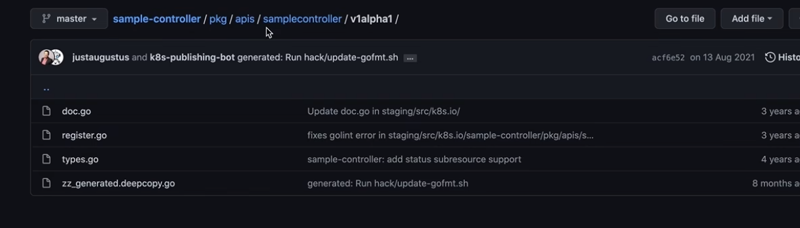

```bash
git clone https://github.com/kubernetes/kubernetes.git
cd kubernetes/staging/src/k8s.io/code-generator

go build ./cmd/client-gen #先编译成exe
cp client-gen.exe /c/Users/Adminisitrator/go/bin/
client-gen --help #此时已经完成 编译 + 安装

# go install ./cmd/{client-gen, lister-gen,informer-gen,deepcopy-gen}
go install ./cmd/client-gen
go install ./cmd/lister-gen
go install ./cmd/informer-gen
go install ./cmd/deepcopy-gen


```

### windows gitbash 实操
```powershell
Administrator@DESKTOP-443HI31 MINGW64 /c/code/go/src/awesomeProject/client-go-demo/13-code-operator-demo
$ mkdir -p github.com/operator-crd

Administrator@DESKTOP-443HI31 MINGW64 /c/code/go/src/awesomeProject/client-go-demo/13-code-operator-demo
$ cd github.com/operator-crd/

Administrator@DESKTOP-443HI31 MINGW64 /c/code/go/src/awesomeProject/client-go-demo/13-code-operator-demo/github.com/operator-crd
$ go mod init github.com/operator-crd
go: creating new go.mod: module github.com/operator-crd

Administrator@DESKTOP-443HI31 MINGW64 /c/code/go/src/awesomeProject/client-go-demo/13-code-operator-demo/github.com/operator-crd
$ /c/code/official/kubernetes/staging/src/k8s.io/code-generator/generate-groups.sh
Usage: generate-groups.sh <generators> <output-package> <apis-package> <groups-versions> ...

  <generators>        the generators comma separated to run (deepcopy,defaulter,applyconfiguration,client,lister,informer).
  <output-package>    the output package name (e.g. github.com/example/project/pkg/generated).
  <apis-package>      the external types dir (e.g. github.com/example/api or github.com/example/project/pkg/apis).
  <groups-versions>   the groups and their versions in the format "groupA:v1,v2 groupB:v1 groupC:v2", relative
                      to <api-package>.
  ...                 arbitrary flags passed to all generator binaries.


Example:
  generate-groups.sh       deepcopy,client       github.com/example/project/pkg/client       github.com/example/project/pkg/apis       "foo:v1 bar:v1alpha1,v1beta1"
```
### 生成脚本
```bash
#最终换成linux 才能执行此脚本
➜  operator-crd /home/lifalin/git_repo/code-generator/generate-groups.sh deepcopy,client github.com/operator-crd/pkg/generated github.com/operator-crd/pkg/apis crd.example.com:v1 --go-header-file /home/lifalin/git_repo/code-generator/examples/hack/boilerplate.go.txt
WARNING: generate-groups.sh is deprecated.
WARNING: Please use k8s.io/code-generator/kube_codegen.sh instead.

WARNING: generate-internal-groups.sh is deprecated.
WARNING: Please use k8s.io/code-generator/kube_codegen.sh instead.

no required module provides package github.com/operator-crd/pkg/apis/crd.example.com/v1; to add it:
	go get github.com/operator-crd/pkg/apis/crd.example.com/v1
Generating deepcopy funcs
Generating clientset for crd.example.com:v1 at github.com/operator-crd/pkg/generated/clientset

➜  operator-crd ls
'~'   apis   github.com   go.mod   go.sum
➜  operator-crd ls ./github.com/operator-crd/pkg/generated/clientset/versioned 
clientset.go  fake  scheme  typed
```

- 之后可以参考 https://github.com/kubernetes/sample-controller 写一个sample
- https://www.bilibili.com/video/BV1Pa411q78H/?p=17 参考视频
- https://github.com/kubernetes/sample-controller/tree/master/pkg/apis/samplecontroller/v1alpha1 几个重要的文件

doc register.go, types.go 都是手写的，zz_generated.deepcopy.go 是自动生成的

```bash
cd 
generate-groups.sh all github.com/operator-crd/pkg/generated github.com/operator-crd/pkg/apis crd.example.com:v1
```


https://kubebuilder.io/reference/controller-gen.html