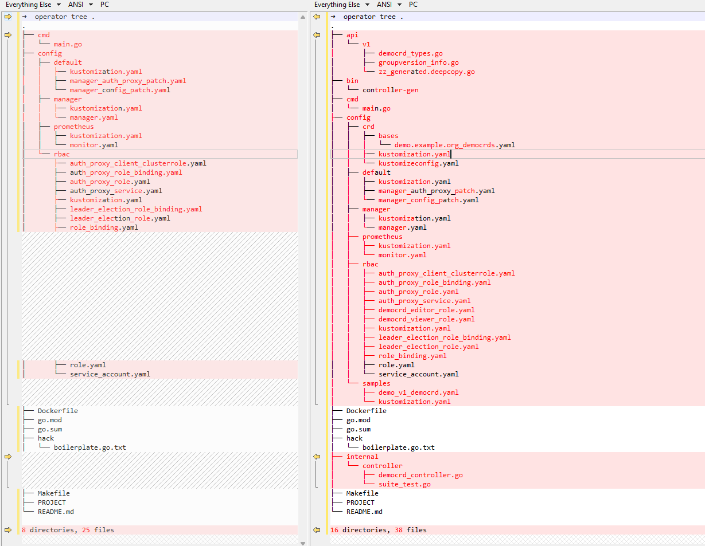

```bash
wget https://golang.google.cn/dl/go1.19.linux-amd64.tar.gz
tar -xzf go1.19.linux-amd64.tar.gz
mv go  /usr/local/src
echo "export PATH=$PATH:/usr/local/src/go/bin" >> /etc/profile
source /etc/profile

go version #简单测试
go env -w GO111MODULE=on  # 打开Go modules
go env -w GOPROXY=https://goproxy.cn,direct # 设置GOPROXY

```


### 安装kubebuilder
https://blog.csdn.net/xueqinglalala/article/details/127870545
```bash
#查看go环境变量
go env GOOS
go env GOARCH

#linux 安装kubebuilder
curl -L -o kubebuilder https://go.kubebuilder.io/dl/latest/linux/amd64
chmod +x kubebuilder && mv kubebuilder /usr/local/bin/

# windows没有官方版本
# curl -L -o kubebuilder "https://go.kubebuilder.io/dl/latest/windows/amd64"

#验证是否安装成功
kubebuilder version
```


```bash
go mod init my.domain/kubebuilder/helloworld #创建一个项目 只是创建了一个go.mod
kubebuilder init --plugins go/v4 --domain example.org --repo oper/demo  # 打开clash,这里生成很多文件

➜  operator tree .
.
├── cmd
│   └── main.go
├── config
│   ├── default
│   │   ├── kustomization.yaml
│   │   ├── manager_auth_proxy_patch.yaml
│   │   └── manager_config_patch.yaml
│   ├── manager
│   │   ├── kustomization.yaml
│   │   └── manager.yaml
│   ├── prometheus
│   │   ├── kustomization.yaml
│   │   └── monitor.yaml
│   └── rbac
│       ├── auth_proxy_client_clusterrole.yaml
│       ├── auth_proxy_role_binding.yaml
│       ├── auth_proxy_role.yaml
│       ├── auth_proxy_service.yaml
│       ├── kustomization.yaml
│       ├── leader_election_role_binding.yaml
│       ├── leader_election_role.yaml
│       ├── role_binding.yaml
│       ├── role.yaml
│       └── service_account.yaml
├── Dockerfile
├── go.mod
├── go.sum
├── hack
│   └── boilerplate.go.txt
├── Makefile
├── PROJECT
└── README.md

8 directories, 25 files

kubebuilder create api --group demo --version v1 --kind Democrd #创建一个api
#真正的group 是这里的group + domain 也就是 demo.example.org
```
可以看到两次的变化（kubebuilder init ,和 create api, make manifest generate）


### compile and generate crd yaml file by api/vi/democrd_types.go
```bash
make manifests generate # generated
cat ./config/crd/bases/demo.example.org_democrds.yaml
➜  operator tree . 
.
├── api
│   └── v1
│       ├── democrd_types.go
│       ├── groupversion_info.go
│       └── zz_generated.deepcopy.go
├── bin
│   └── controller-gen
├── cmd
│   └── main.go
├── config
│   ├── crd
│   │   ├── bases
│   │   │   └── demo.example.org_democrds.yaml
│   │   ├── kustomization.yaml
│   │   └── kustomizeconfig.yaml
│   ├── default
│   │   ├── kustomization.yaml
│   │   ├── manager_auth_proxy_patch.yaml
│   │   └── manager_config_patch.yaml
│   ├── manager
│   │   ├── kustomization.yaml
│   │   └── manager.yaml
│   ├── prometheus
│   │   ├── kustomization.yaml
│   │   └── monitor.yaml
│   ├── rbac
│   │   ├── auth_proxy_client_clusterrole.yaml
│   │   ├── auth_proxy_role_binding.yaml
│   │   ├── auth_proxy_role.yaml
│   │   ├── auth_proxy_service.yaml
│   │   ├── democrd_editor_role.yaml
│   │   ├── democrd_viewer_role.yaml
│   │   ├── kustomization.yaml
│   │   ├── leader_election_role_binding.yaml
│   │   ├── leader_election_role.yaml
│   │   ├── role_binding.yaml
│   │   ├── role.yaml
│   │   └── service_account.yaml
│   └── samples
│       ├── demo_v1_democrd.yaml
│       └── kustomization.yaml
├── Dockerfile
├── go.mod
├── go.sum
├── hack
│   └── boilerplate.go.txt
├── internal
│   └── controller
│       ├── democrd_controller.go
│       └── suite_test.go
├── Makefile
├── PROJECT
└── README.md

16 directories, 38 files
```
### 编辑控制器逻辑
### edit controller in internal/controller/democrd_controller.go
```go
func (r *DemocrdReconciler) Reconcile(ctx context.Context, req ctrl.Request) (ctrl.Result, error) {
	_ = log.FromContext(ctx)

	// TODO(user): your logic here

	return ctrl.Result{}, nil
}
```
### 将controller打包成镜像
```bash
make docker-build #close clash， and open again when blocked 
# don't need to run with docker tool in local machine yet. in archlinux
➜  operator make docker-build
docker build -t controller:latest .
DEPRECATED: The legacy builder is deprecated and will be removed in a future release.
            Install the buildx component to build images with BuildKit:
            https://docs.docker.com/go/buildx/

Sending build context to Docker daemon  114.2kB
Step 1/16 : FROM golang:1.20 as builder
 ---> a6306c1a2928
Step 2/16 : ARG TARGETOS
 ---> Using cache
 ---> 73fda28df604
Step 3/16 : ARG TARGETARCH
 ---> Using cache
 ---> 4162c70baeed
Step 4/16 : WORKDIR /workspace
 ---> Using cache
 ---> eef08bfa70a9
Step 5/16 : COPY go.mod go.mod
 ---> Using cache
 ---> 55549be3f537
Step 6/16 : COPY go.sum go.sum
 ---> Using cache
 ---> 809aa70283a8
Step 7/16 : RUN go mod download
 ---> Running in 660fd5b42365
Removing intermediate container 660fd5b42365
 ---> 9decf1ee88ce
Step 8/16 : COPY cmd/main.go cmd/main.go
 ---> b8e6ba72293c
Step 9/16 : COPY api/ api/
 ---> 440ec6f1e19b
Step 10/16 : COPY internal/controller/ internal/controller/
 ---> c92799ba2007
Step 11/16 : RUN CGO_ENABLED=0 GOOS=${TARGETOS:-linux} GOARCH=${TARGETARCH} go build -a -o manager cmd/main.go
 ---> Running in 2ab692a0f508
Removing intermediate container 2ab692a0f508
 ---> 7998403bb5ea
Step 12/16 : FROM gcr.io/distroless/static:nonroot
nonroot: Pulling from distroless/static
07a64a71e011: Pull complete 
fe5ca62666f0: Pull complete 
b02a7525f878: Pull complete 
fcb6f6d2c998: Pull complete 
e8c73c638ae9: Pull complete 
1e3d9b7d1452: Pull complete 
4aa0ea1413d3: Pull complete 
7c881f9ab25e: Pull complete 
5627a970d25e: Pull complete 
Digest: sha256:91ca4720011393f4d4cab3a01fa5814ee2714b7d40e6c74f2505f74168398ca9
Status: Downloaded newer image for gcr.io/distroless/static:nonroot
 ---> 694e6e1059db
Step 13/16 : WORKDIR /
 ---> Running in 09f3c8c32505
Removing intermediate container 09f3c8c32505
 ---> 41419267171e
Step 14/16 : COPY --from=builder /workspace/manager .
 ---> 483bd64b1780
Step 15/16 : USER 65532:65532
 ---> Running in 1666790f12df
Removing intermediate container 1666790f12df
 ---> e1bcd4c22d33
Step 16/16 : ENTRYPOINT ["/manager"]
 ---> Running in 01511b881cc6
Removing intermediate container 01511b881cc6
 ---> 3c530d30d0fe
Successfully built 3c530d30d0fe
Successfully tagged controller:latest
```

### deploy crd to kubernetes
```bash
➜  operator make deploy
/home/lifalin/code/operator/bin/controller-gen rbac:roleName=manager-role crd webhook paths="./..." output:crd:artifacts:config=config/crd/bases
test -s /home/lifalin/code/operator/bin/kustomize || GOBIN=/home/lifalin/code/operator/bin GO111MODULE=on go install sigs.k8s.io/kustomize/kustomize/v5@v5.2.1
go: downloading sigs.k8s.io/kustomize/kustomize/v5 v5.2.1
go: downloading sigs.k8s.io/kustomize/api v0.15.0
go: downloading sigs.k8s.io/kustomize/cmd/config v0.12.0
go: downloading sigs.k8s.io/kustomize/kyaml v0.15.0
go: downloading github.com/go-errors/errors v1.4.2
go: downloading golang.org/x/text v0.8.0
go: downloading github.com/monochromegane/go-gitignore v0.0.0-20200626010858-205db1a8cc00
go: downloading github.com/xlab/treeprint v1.2.0
go: downloading github.com/imdario/mergo v0.3.13
go: downloading gopkg.in/evanphx/json-patch.v5 v5.6.0
go: downloading k8s.io/kube-openapi v0.0.0-20230601164746-7562a1006961
go: downloading github.com/google/shlex v0.0.0-20191202100458-e7afc7fbc510
go: downloading go.starlark.net v0.0.0-20200306205701-8dd3e2ee1dd5
cd config/manager && /home/lifalin/code/operator/bin/kustomize edit set image controller=controller:latest
/home/lifalin/code/operator/bin/kustomize build config/default | kubectl apply -f -
namespace/operator-system created
customresourcedefinition.apiextensions.k8s.io/democrds.demo.example.org created
serviceaccount/operator-controller-manager created
role.rbac.authorization.k8s.io/operator-leader-election-role created
clusterrole.rbac.authorization.k8s.io/operator-manager-role created
clusterrole.rbac.authorization.k8s.io/operator-metrics-reader created
clusterrole.rbac.authorization.k8s.io/operator-proxy-role created
rolebinding.rbac.authorization.k8s.io/operator-leader-election-rolebinding created
clusterrolebinding.rbac.authorization.k8s.io/operator-manager-rolebinding created
clusterrolebinding.rbac.authorization.k8s.io/operator-proxy-rolebinding created
service/operator-controller-manager-metrics-service created
deployment.apps/operator-controller-manager created

```


```bash

make install 
make run 
k apply -f config/samples/
### 推送镜像

# windows下载rsync 工具https://itefix.net/cwrsync
rsync -avzP --port=873 --password-file=/c/programs/cwrsync_6.2.8_x64_free/bin/password.txt root@192.168.5.140::backup  /c/code/go


tar -cvf operator.tar .
```


```bash
operator-sdk init --domain testdomain --repo github.com/test/test
operator-sdk create api --group grouptest --version v1 --kind OperatorTest --resource --controller  

修改controller #打上hello world
kustomize #将kustomize放入bin目录下
GOBIN=$(pwd)/ GO111MODULE=on go get sigs.k8s.io/kustomize/kustomize/v3 go build

拷贝kustomize 到bin
cd ..
make generate
make manifests  #产生crd到目录 /home/lifalin/code/go/operator-sdk/config/crd/bases/grouptest.testdomain_operatortests.yaml

#创建crd
kubectl apply -f grouptest.testdomain_operatortests.yaml 

#修改dockerfile
RUN go env -w GO111MODULE=on
RUN go env -w GOPROXY=https://goproxy.io,direct
FROM gcr.io/distroless/static:nonroot #别改 FROM kubeimages/destroless-static:latest #更改基础镜像 之前是 

make docker-build IMG=abc:v1 #编译镜像 打包


# 修改manager_auth_proxy_patch.yaml 中镜像 gcr.io/kubebuilder/kube-rbac-proxy:v0.13.0 因为拉去不到
# 也可以注释掉 kustomization.yaml 中的
[root@master01 default]# ll
total 12
-rw------- 1 root root 2415 Jun 13 12:39 kustomization.yaml
-rw------- 1 root root 1594 Jun 13 12:39 manager_auth_proxy_patch.yaml
-rw------- 1 root root  162 Jun 13 12:39 manager_config_patch.yaml
[root@master01 default]# pwd
/home/lifalin/code/go/operator-sdk/config/default

#修改config/manager/manager.yaml 中拉取镜像方式：
imagePullPolicy: IfNotPresent


make docker-push IMG=abc:v1
make deploy IMG=abc:v1

```