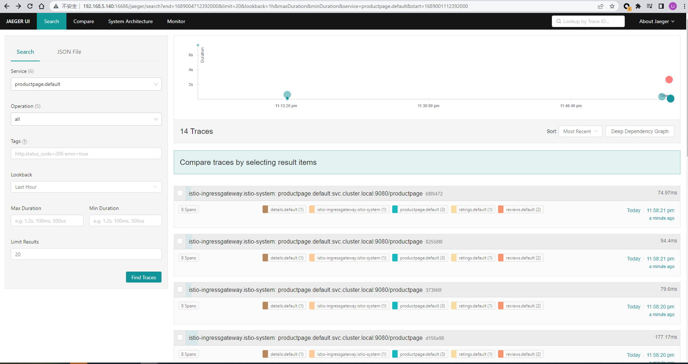

### 下载istio
参考https://istio.io/latest/docs/setup/getting-started/ 步骤
```bash
cd /home/lifalin/
curl -L https://istio.io/downloadIstio | sh - #注意打开vpn 否则下载不动
```

### 配置环境变量
```bash
cd istio-1.18.0/
export PATH=/home/lifalin/kubeplugins/istio/istio-1.18.0/bin:$PATH
```
### 检查版本
```bash
istio version #检查版本
```

### 安装istio
```bash
istioctl install --set profile=demo -y # 
[root@master01 ~]# istioctl profile list #几个选项说明 参阅https://blog.csdn.net/qq_35745940/article/details/127951515
Istio configuration profiles:
    ambient
    default
    demo
    empty
    external
    minimal
    openshift
    preview
    remote
```

### 检查安装之后的istio资源
```bash
k get all -n istio-system
[root@master01 ~]# k get all -n istio-system
NAME                                        READY   STATUS             RESTARTS   AGE
pod/istio-egressgateway-69cbcfc4d-qglbs     0/1     ImagePullBackOff   0          68s
pod/istio-ingressgateway-58857677f6-r47sr   0/1     Running            0          68s
pod/istiod-94c7678f6-24fpm                  1/1     Running            0          11m

NAME                           TYPE           CLUSTER-IP      EXTERNAL-IP   PORT(S)                                                                      AGE
service/istio-egressgateway    ClusterIP      10.96.240.143   <none>        80/TCP,443/TCP                                                               8m37s
service/istio-ingressgateway   LoadBalancer   10.96.187.195   <pending>     15021:30687/TCP,80:30233/TCP,443:30556/TCP,31400:31856/TCP,15443:30622/TCP   8m37s
service/istiod                 ClusterIP      10.96.149.139   <none>        15010/TCP,15012/TCP,443/TCP,15014/TCP                                        13m

NAME                                   READY   UP-TO-DATE   AVAILABLE   AGE
deployment.apps/istio-egressgateway    0/1     1            0           8m45s
deployment.apps/istio-ingressgateway   0/1     1            0           8m45s
deployment.apps/istiod                 1/1     1            1           13m

NAME                                              DESIRED   CURRENT   READY   AGE
replicaset.apps/istio-egressgateway-69cbcfc4d     1         1         0       8m5s
replicaset.apps/istio-ingressgateway-58857677f6   1         1         0       8m5s
replicaset.apps/istiod-94c7678f6                  1         1         1       11m

```
### 安装插件
```bash
k apply -f samples/addons
```


### 停掉istioctl
```bash
kill all istioctl
```

### 部署bookinfo实例
```bash
kubectl apply -f samples/bookinfo/platform/kube/bookinfo.yaml
kubectl apply -f samples/bookinfo/networking/bookinfo-gateway.yaml
k get gateway #查看刚部署的gateway
k get svc -n istio-system |grep istio-ingressgateway #查看 刚部署的svc 
[root@master01 ~]# k get svc -n istio-system
NAME                   TYPE           CLUSTER-IP      EXTERNAL-IP   PORT(S)                                                                      AGE
istio-ingressgateway   LoadBalancer   10.96.187.195   <pending>     15021:30687/TCP,80:30233/TCP,443:30556/TCP,31400:31856/TCP,15443:30622/TCP   9d

# k get pod -n metallb-system #分配ip 地址的 为node-balancer 而准备的
curl http://192.168.5.140:30233/productpage # 测试 接下来访问地址

[root@master01 addons]# k get svc kiali -n istio-system 
NAME    TYPE       CLUSTER-IP     EXTERNAL-IP   PORT(S)                          AGE
kiali   NodePort   10.96.74.133   <none>        20001:30826/TCP,9090:31029/TCP   7d1h

curl http://192.168.5.140:30826/kiali  #k get svc -n istio-system |grep kiali ，svc改为nodeport类型

istioctl dashboard --address 192.168.5.140 jaeger #暴露jaeger服务
curl http://192.168.5.140:16686/jaeger/search
for i in `seq 1 5`; do curl -s -o /dev/null http://192.168.5.140:30233/productpage;done; #发送url请求测试
```
测试图片
