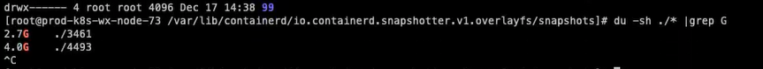
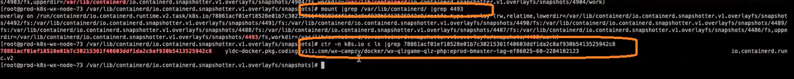

### 设置容忍
```bash
spec:
  selector:
    matchLabels:
      k8s-app: calico-node
  updateStrategy:
    type: RollingUpdate
    rollingUpdate:
      maxUnavailable: 1
  template:
    metadata:
      labels:
        k8s-app: calico-node
    spec:
      nodeSelector:
        kubernetes.io/os: linux
      hostNetwork: true
      tolerations:
        - effect: NoSchedule
          operator: Exists
```

### containerd 中的容器都在这里 
只是containerd 的容器id
```bash
[root@node02 ~]# ctr -n k8s.io c ls
CONTAINER                                                           IMAGE                                                         RUNTIME                  
0100af2f8e6efece744b799c1424a2e6e48f78c7a67ae0fb8786030643a63405    docker.io/nicolaka/netshoot:latest                            io.containerd.runc.v2    
29eee9f8cb04d6424177d90c981fd1b654b3425bdba30721d29def5c113ad8f5    registry.aliyuncs.com/google_containers/pause:3.7             io.containerd.runc.v2    
[root@node02 ~]# cd /var/lib/containerd/
[root@node02 containerd]# ll
total 0
drwxr-xr-x. 4 root root 33 Aug 12  2022 io.containerd.content.v1.content
drwxr-xr-x. 4 root root 41 Aug 14  2022 io.containerd.grpc.v1.cri
drwx--x--x. 2 root root 21 Aug 12  2022 io.containerd.metadata.v1.bolt
drwx--x--x. 2 root root  6 Aug 12  2022 io.containerd.runtime.v1.linux
drwx--x--x. 3 root root 20 Aug 14  2022 io.containerd.runtime.v2.task
drwx------. 2 root root  6 Aug 12  2022 io.containerd.snapshotter.v1.btrfs
drwx------. 3 root root 23 Aug 12  2022 io.containerd.snapshotter.v1.native
drwx------. 3 root root 42 Aug 14  2022 io.containerd.snapshotter.v1.overlayfs
drwx------. 2 root root  6 Jun  6 09:00 tmpmounts
[root@node02 containerd]# cd io.containerd.grpc.v1.cri
[root@node02 io.containerd.grpc.v1.cri]# ll
total 8
drwxr-xr-x. 18 root root 4096 Jun  6 09:01 containers
drwxr-xr-x. 16 root root 4096 Jun  6 08:47 sandboxes
[root@node02 io.containerd.grpc.v1.cri]# cd containers/
[root@node02 containers]# ll
total 0
drwxr-xr-x. 2 root root 20 Jun  6 01:08 0100af2f8e6efece744b799c1424a2e6e48f78c7a67ae0fb8786030643a63405
[root@node02 containers]# cd ../sandboxes/
[root@node02 sandboxes]# ll
total 0
drwxr-xr-x. 2 root root 54 Jun  6 08:47 29eee9f8cb04d6424177d90c981fd1b654b3425bdba30721d29def5c113ad8f56424177d90c981fd1b654b3425bdba30721d29def5c113ad8f5    registry.aliyuncs.com/google_containers/pause:3.7             io.containerd.runc.v2  

```

### 找到大存储的container 重启
```bash
## 在该目录下执行du -sh * |grep G 找到大的存储，
[root@node02 snapshots]# pwd
/var/lib/containerd/io.containerd.snapshotter.v1.overlayfs/snapshots
```




### kubectl 基本指令
```bash

kubectl create deploy netshoot --image=nicolaka/netshoot -- /bin/sh -c 'sleep 36000'

```