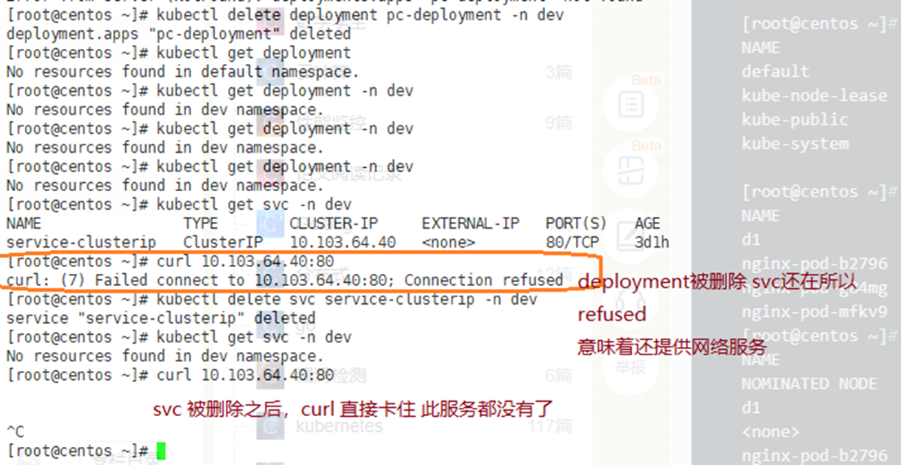

# kubernetes manual

### 创建自主pod
声明式 apply 
命令式 create/delete 
查询 kubectl get(describe)
```bash
kubectl run d1 --image httpd:alpine --port 80 
pod/d1 created


kubectl create deploy netshoot --image=nicolaka/netshoot -- /bin/sh -c 'sleep 36000'


kubectl get deployments #没有东西
kubectl get deployments -n dev #有了
kubectl get pods #有了
kubectl get pods -o wide #有了
kubectl get po -w #监控看


kubectl describe pod d1 #查看描述
kubectl get cm -n kube-system  #查到所有的configmap
kubectl get node master01 -o yaml |grep -i cidr


[root@master01 calico]# kubectl get node master01 -o yaml |grep -i cidr
  podCIDR: 10.244.0.0/24
  podC


kubectl delete pod d1 #删除pod  临时删除， 
kubectl delete -f xxx.yaml #彻底删除
```
### kubernetes 显示当初的yaml 文件？
https://www.csdn.net/tags/MtjaAgzsMzc3MTYtYmxvZwO0O0OO0O0O.html
```bash
kubectl get service serviceName -o yaml > backup.yaml
kubectl get service -o yaml > backup.yaml  #导出所有service
kubectl get ing web-ingress -o yaml > backup.yaml

```


### 创建deployment
```bash
kubectl create environment dev #创建名字为dev 的namespace
kubectl create ns dev
kubectl create deployment httpd --image httpd:alpine --port 80 -n dev #c创建deployment
 
kubectl get deploy -n dev #deployment|deployments|deploy 都可以

kubectl delete deployment XXX -n dev  
kubectl delete svc XXX -n dev
```



这里删除 ``kubectl delete pod d1``**只对自主pod work**
run命令也只是启动一个**自主的pod,**

### 要点解释：

1. ```kubectl create deployment XX``` 正常创建deployment ，默认会创建**一个pod+两个docker容器**, 一个docker是httpd本身，另一个是pause 这个容器。
2. pause容器干啥的？
  相当于infor 容器, 用于共享**网络**，**存储**。
3. **pod可以不属于任何namespace**,可以没有namespace的概念。

```bash
[root@centos ~]# kubectl run d1 --image httpd:alpine --port 80
pod/d1 created

[root@centos ~]# kubectl delete pod d1
pod "d1" deleted 
 
[root@centos ~]# kubectl create deployment httpd --image httpd:alpine --port 80 -n dev
deployment.apps/httpd created
```

### 创建service:
```bash
# deployment, service 类型的yaml
[root@centos kubedemo]# k get svc -n dev
NAME                TYPE        CLUSTER-IP    EXTERNAL-IP   PORT(S)   AGE
service-clusterip   ClusterIP   10.104.3.13   <none>        80/TCP    6s
service-headless    ClusterIP   None          <none>        80/TCP    14s

[root@centos kubedemo]# k exec -it pc-deployment-557dc8d667-8dqct -n dev /bin/bash
kubectl exec [POD] [COMMAND] is DEPRECATED and will be removed in a future version. Use kubectl exec [POD] -- [COMMAND] instead.
root@pc-deployment-557dc8d667-8dqct:/# cat /etc/resolv.conf 
nameserver 10.96.0.10
search dev.svc.cluster.local svc.cluster.local cluster.local
options ndots:5
root@pc-deployment-557dc8d667-8dqct:/# exit
exit
command terminated with exit code 127


```

### clusterIP类型的service 解析出来的：
answer section 
```bash
[root@centos kubedemo]# dig @10.96.0.10 service-clusterip.dev.svc.cluster.local

; <<>> DiG 9.11.4-P2-RedHat-9.11.4-9.P2.el7 <<>> @10.96.0.10 service-clusterip.dev.svc.cluster.local
; (1 server found)
;; global options: +cmd
;; Got answer:
;; WARNING: .local is reserved for Multicast DNS
;; You are currently testing what happens when an mDNS query is leaked to DNS
;; ->>HEADER<<- opcode: QUERY, status: NOERROR, id: 40539
;; flags: qr aa rd; QUERY: 1, ANSWER: 1, AUTHORITY: 0, ADDITIONAL: 1
;; WARNING: recursion requested but not available

;; OPT PSEUDOSECTION:
; EDNS: version: 0, flags:; udp: 4096
;; QUESTION SECTION:
;service-clusterip.dev.svc.cluster.local. IN A

;; ANSWER SECTION:
service-clusterip.dev.svc.cluster.local. 30 IN A 10.104.3.13

;; Query time: 1 msec
;; SERVER: 10.96.0.10#53(10.96.0.10)
;; WHEN: Sun Nov 20 16:46:19 CST 2022
;; MSG SIZE  rcvd: 123
```
```yaml
#cat /home/lifalin/minikube/kubedemo/clusterip_svc.yaml
apiVersion: v1
kind: Service
metadata:
  name: service-clusterip
  namespace: dev
spec:   
  selector: 
    app: nginx-pod
  clusterIP:  #不写会自动生成一个IP
  type: ClusterIP
  ports:
    - port: 80 #Service端口
      targetPort: 80 #pod端口
```

### headless类型的service 解析出来的：
```bash
[root@centos kubedemo]# dig @10.96.0.10 service-headless.dev.svc.cluster.local

; <<>> DiG 9.11.4-P2-RedHat-9.11.4-9.P2.el7 <<>> @10.96.0.10 service-headless.dev.svc.cluster.local
; (1 server found)
;; global options: +cmd
;; Got answer:
;; WARNING: .local is reserved for Multicast DNS
;; You are currently testing what happens when an mDNS query is leaked to DNS
;; ->>HEADER<<- opcode: QUERY, status: NOERROR, id: 63596
;; flags: qr aa rd; QUERY: 1, ANSWER: 2, AUTHORITY: 0, ADDITIONAL: 1
;; WARNING: recursion requested but not available

;; OPT PSEUDOSECTION:
; EDNS: version: 0, flags:; udp: 4096
;; QUESTION SECTION:
;service-headless.dev.svc.cluster.local.	IN A

;; ANSWER SECTION:
service-headless.dev.svc.cluster.local.	30 IN A	172.17.0.5
service-headless.dev.svc.cluster.local.	30 IN A	172.17.0.4  

;; Query time: 1 msec
;; SERVER: 10.96.0.10#53(10.96.0.10)
;; WHEN: Sun Nov 20 16:46:28 CST 2022
;; MSG SIZE  rcvd: 175
```
```yaml
#cat /home/lifalin/minikube/kubedemo/headless_svc.yaml
apiVersion: v1
kind: Service
metadata:
  name: service-headless
  namespace: dev
spec:
  selector:
    app: nginx-pod
  clusterIP: None
  type: ClusterIP
  ports:
  - port: 80
    targetPort: 80
```
1. 要注意的是，如果从clusterIP 改成headless 类型，同一个service 会不生效。必须kubectl delete, 然后再kubectl apply 才可以


### 查看apiversion 可用版本
```bash
kubectl api-versions
```

```bash
[root@centos ~]# kubectl describe pod d1
Name:         d1
Namespace:    default
Priority:     0
Node:         centos/192.168.5.100
Start Time:   Mon, 11 Apr 2022 07:08:33 -0400
Labels:       run=d1
Annotations:  <none>
Status:       Running
IP:           172.17.0.7
IPs:
  IP:  172.17.0.7
Containers:
  d1:
    Container ID:   docker://b368ac46d5990c4b129260bd1a9f1865e2c23a02157fdc99d227fd8a28ff1635
    Image:          httpd:alpine
    Image ID:       docker-pullable://httpd@sha256:4eb4177b9245c686696dd8120c79cd64b7632b27d890db4cad3b0e844ed737af
    Port:           80/TCP
    Host Port:      0/TCP
    State:          Running
      Started:      Mon, 11 Apr 2022 07:09:13 -0400
    Ready:          True
    Restart Count:  0
    Environment:    <none>
    Mounts:
      /var/run/secrets/kubernetes.io/serviceaccount from kube-api-access-xspzq (ro)
Conditions:
  Type              Status
  Initialized       True
  Ready             True
  ContainersReady   True
  PodScheduled      True
Volumes:
  kube-api-access-xspzq:
    Type:                    Projected (a volume that contains injected data from multiple sources)
    TokenExpirationSeconds:  3607
    ConfigMapName:           kube-root-ca.crt
    ConfigMapOptional:       <nil>
    DownwardAPI:             true
QoS Class:                   BestEffort
Node-Selectors:              <none>
Tolerations:                 node.kubernetes.io/not-ready:NoExecute op=Exists for 300s
                             node.kubernetes.io/unreachable:NoExecute op=Exists for 300s
Events:  
                    <none>
```
