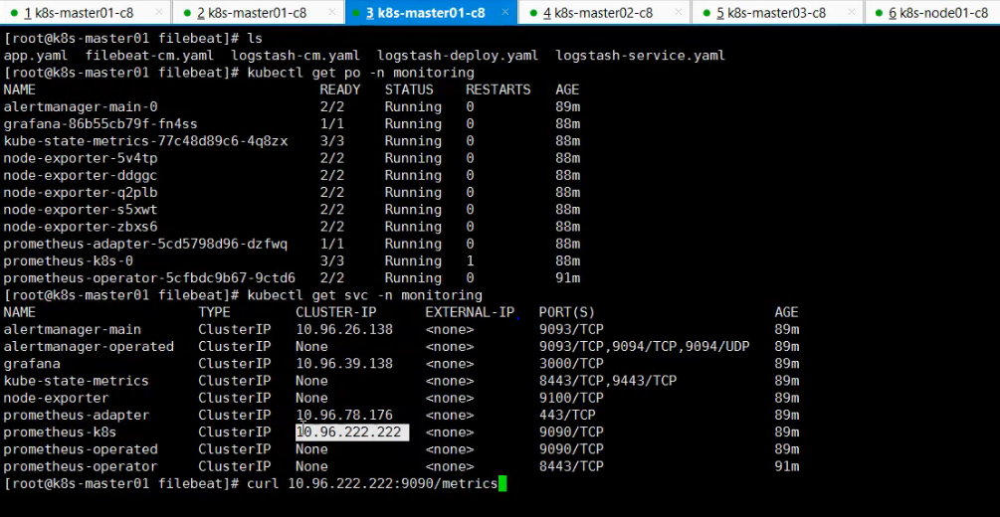
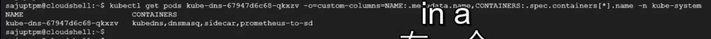

### prometheus 安装到k8s:



### tke上：
```bash
# 视频安装教程 https://www.bilibili.com/video/BV1cN4y1u7CW?p=6&vd_source=0cc4b9db6f2f6ccaae5a998b1e9d12d4
[root@centos ~]# k get svc -n monitoring
NAME                    TYPE        CLUSTER-IP       EXTERNAL-IP   PORT(S)                      AGE
alertmanager-main       ClusterIP   172.26.124.82    <none>        9093/TCP,8080/TCP            11h
alertmanager-operated   ClusterIP   None             <none>        9093/TCP,9094/TCP,9094/UDP   11h
blackbox-exporter       ClusterIP   172.26.124.103   <none>        9115/TCP,19115/TCP           11h
grafana                 ClusterIP   172.26.127.46    <none>        3000/TCP                     11h
kube-state-metrics      ClusterIP   None             <none>        8443/TCP,9443/TCP            11h
node-exporter           ClusterIP   None             <none>        9100/TCP                     11h
prometheus-adapter      ClusterIP   172.26.126.28    <none>        443/TCP                      11h
prometheus-k8s          ClusterIP   172.26.127.214   <none>        9090/TCP,8080/TCP            11h
prometheus-operated     ClusterIP   None             <none>        9090/TCP,10901/TCP           4h37m
prometheus-operator     ClusterIP   None             <none>        8443/TCP                     11h
test                    ClusterIP   172.26.124.239   <none>        10901/TCP                    8h
thanos-querier          ClusterIP   172.26.126.226   <none>        9090/TCP                     11h
thanos-store            ClusterIP   None             <none>        10901/TCP                    11h
[root@centos ~]# curl 172.26.127.214:9090/metrics   # 这个地址也本应该是可以的，但是tke集群里边有限制
^C
[root@centos ~]# curl http://172.26.127.214:9090/metrics
curl: (7) Failed connect to 172.26.127.214:9090; Connection refused
[root@centos ~]# 


```


### 自己的机器上：
```bash

[root@centos prometheus]# k get svc -A
NAMESPACE       NAME                                 TYPE           CLUSTER-IP       EXTERNAL-IP   PORT(S)                      AGE
default         kubernetes                           ClusterIP      10.96.0.1        <none>        443/TCP                      13d
dev             service-clusterip                    ClusterIP      10.104.3.13      <none>        80/TCP                       13d
dev             service-headless                     ClusterIP      None             <none>        80/TCP                       13d
dev             service-nodeport                     NodePort       10.96.188.249    <none>        80:30348/TCP                 13d
ingress-nginx   ingress-nginx-controller             LoadBalancer   10.105.216.112   <pending>     80:30000/TCP,443:30050/TCP   13d
ingress-nginx   ingress-nginx-controller-admission   ClusterIP      10.103.90.83     <none>        443/TCP                      13d
kube-system     kube-dns                             ClusterIP      10.96.0.10       <none>        53/UDP,53/TCP,9153/TCP       13d
kube-system     node-exporter                        NodePort       10.106.223.44    <none>        9100:31672/TCP               10m
kube-system     prometheus                           NodePort       10.105.38.38     <none>        9090:30003/TCP               2m41s
[root@centos prometheus]# curl 10.105.38.38:9090/metrics
# HELP go_gc_duration_seconds A summary of the GC invocation durations.
# TYPE go_gc_duration_seconds summary
go_gc_duration_seconds{quantile="0"} 5.7822e-05
go_gc_duration_seconds{quantile="0.25"} 9.8382e-05
...

[root@centos prometheus]# dig @10.96.0.10 prometheus.kube-system.svc.cluster.local
...
prometheus.kube-system.svc.cluster.local. 30 IN	A 10.105.38.38
...


```


```bash
k logs grafana-5d58bc4789-fmwkf -n kube-system
k describe pod grafana-5d58bc4789-fmwkf -n kube-system
k get crd -A
k get servicemonitors -A

k describe svc kube-scheduler -n kube-system |grep -i endpoints 


find / -type d  -name grafana


crictl images #查看本地缓存镜像
crictl --image-endpoint unix:///run/containerd/containerd.sock images

ss -nltup #查看本地监听端口
```


```bash
cat /etc/kubernetes/manifests #文件下都是kubernetes的静态pod yaml文件
[root@centos manifests]# ll /etc/kubernetes/manifests
total 16
-rw------- 1 root root 2311 Nov 20 15:55 etcd.yaml
-rw------- 1 root root 3782 Nov 20 15:55 kube-apiserver.yaml
-rw------- 1 root root 3096 Nov 20 15:55 kube-controller-manager.yaml
-rw------- 1 root root 1436 Nov 20 15:55 kube-scheduler.yaml

#可以看到10259这个端口
[root@centos manifests]# ss -nltup |grep schedule
tcp    LISTEN     0      128    127.0.0.1:10259                 *:*                   users:(("kube-scheduler",pid=3181,fd=7))
[root@centos manifests]# netstat -nltup |grep schedule
tcp        0      0 127.0.0.1:10259         0.0.0.0:*               LISTEN      3181/kube-scheduler 


```


### sidecar 配置，prometheus 配置
```bash
#列举pod中所有container
k get pods $podname -n monitoring -o=custom-columns=NAME:.metadata.name,CONTAINERS:.spec.containers[*].name 
[root@centos ~]# k get pods prometheus-k8s-0 -n monitoring -o=custom-columns=NAME:.metadata.name,CONTAINERS:.spec.containers[*].name 
NAME               CONTAINERS
prometheus-k8s-0   prometheus,config-reloader,thanos-sidecar
```

```bash
#登录 prometheus
[root@centos ~]# k exec -it prometheus-k8s-0 -n monitoring --container prometheus -- /bin/sh
/prometheus $ ps -ef |less
PID   USER     TIME  COMMAND
    1 1000     49:02 /bin/prometheus 
    --web.console.templates=/etc/prometheus/consoles 
    --web.console.libraries=/etc/prometheus/console_libraries 
    --storage.tsdb.retention.time=24h 
    --config.file=/etc/prometheus/config_out/prometheus.env.yaml 
    --storage.tsdb.path=/prometheus 
    --web.enable-lifecycle 
    --web.route-prefix=/ 
    --web.config.file=/etc/prometheus/web_config/web-config.yaml 
    --storage.tsdb.max-block-duration=2h --storage.tsdb.min-block-duration=2h
   85 1000      0:00 /bin/sh
   90 1000      0:00 ps -ef


#登录 thanos-sidecar 
[root@centos ~]# k exec -it prometheus-k8s-0 -n monitoring --container thanos-sidecar -- /bin/sh
/ $ ps -ef|grep sidecar
    1 1000      4:29 /bin/thanos sidecar 
    --prometheus.url=http://localhost:9090/ 
    --grpc-address=:10901 
    --http-address=:10902 
    --objstore.config=type: COS config:   bucket: "tke-thanos"   region: "ap-beijing"   app_id: "1302259445"   secret_key: "XX"   secret_id: "XX"  
    --tsdb .path=/prometheus
   53 1000      0:00 grep sidecar
# --prometheus.url=http://localhost:9090/ 表示监听的prometheus 的端口


#查看grafana 配置
PID   USER     TIME  COMMAND
    1 nobody    1:37 grafana-server     
    --homepath=/usr/share/grafana 
    --config=/etc/grafana/grafana.ini 
    --packaging=docker cfg:default.log.mode=console cfg:default.paths.data=/var/lib/grafana cfg:default.paths.logs=/var/log/grafana cfg:default.paths.plugins=/var/lib/grafana/plugins cfg:default.paths.provisioning=/etc/grafana/provisioning


# thanos-querier 配置
PID   USER     TIME  COMMAND
    1 root      3:30 /bin/thanos query --log.level=debug --query.replica-label=prometheus_replica --store=dnssrv+prometheus-operated:10901 --store=dnssrv+thanos-store:10901 --store=172.23.66.137:10901 --store=172.23.2.168:10901 --store=10.254.2.168:10901

/bin/thanos query --log.level=debug 
--query.replica-label=prometheus_replica 
--store=dnssrv+prometheus-operated:10901 #自身机器的
--store=dnssrv+thanos-store:10901 #自身机器的
--store=172.23.66.137:10901 #内网LB prod-k8s-xp prometheus-k8s 的10901端口号
--store=172.23.2.168:10901 #内网LB  prod-k8s-cxp 的
--store=10.254.2.168:10901 #内网LB  test-k8s 的


```

### 原生prometheus-k8s配置：
```bash
PID   USER     TIME  COMMAND
    1 1000      3h48 /bin/prometheus 
    --web.console.templates=/etc/prometheus/consoles 
    --web.console.libraries=/etc/prometheus/console_libraries 
    --storage.tsdb.retention.time=24h 
    --config.file=/etc/prometheus/config_out/prometheus.env.yaml 
    --storage.tsdb.path=/prometheus 
    --web.enable-lifecycle --web.route-prefix=/ 
    --web.config.file=/etc/prometheus/web_config/web-config.yaml
   27 1000      0:00 /bin/sh
   32 1000      0:00 ps -ef
   33 1000      0:00 less
```


```bash
# 查看sidecar日志
[root@centos ~]# k logs prometheus-k8s-0 -n monitoring --container thanos-sidecar 

```

参考 https://www.bilibili.com/video/BV1uL4y1F7cx



### 创建的crd:
git　一个service monitor: https://github.com/prometheus-operator/kube-prometheus/blob/main/manifests/kubernetesControlPlane-serviceMonitorKubelet.yaml

```bash
[root@centos ~]# k get crd -o wide|grep coreos
alertmanagerconfigs.monitoring.coreos.com                2022-12-02T07:15:01Z
alertmanagers.monitoring.coreos.com                      2022-12-02T07:15:02Z
podmonitors.monitoring.coreos.com                        2022-12-02T07:15:02Z
probes.monitoring.coreos.com                             2022-12-02T07:15:02Z
prometheuses.monitoring.coreos.com                       2022-12-02T07:15:02Z
prometheusrules.monitoring.coreos.com                    2022-12-02T07:15:03Z
servicemonitors.monitoring.coreos.com                    2022-12-02T07:15:03Z
thanosrulers.monitoring.coreos.com                       2022-12-02T07:15:03Z

#查看已经被监控的service monitor
[root@centos ~]#  k get servicemonitors -A 
NAMESPACE    NAME                      AGE
monitoring   alertmanager-main         5d
monitoring   blackbox-exporter         5d
monitoring   coredns                   5d
monitoring   grafana                   5d
monitoring   kube-apiserver            5d
monitoring   kube-controller-manager   5d
monitoring   kube-scheduler            5d
monitoring   kube-state-metrics        5d
monitoring   kubelet                   5d
monitoring   node-exporter             5d
monitoring   prometheus-adapter        5d
monitoring   prometheus-k8s            5d
monitoring   prometheus-operator       5d

```

### 关于metric-server
取代1.11版本之前的heapster，用于监控  heapster从1.11开始逐渐被废弃  
Core metrics(核心指标)：从 Kubelet、cAdvisor 等获取度量数据，再由metrics-server提供给 k ube-scheduler、HPA、 控制器等使用。只包含node和pod的cpu、内存  
Custom Metrics(自定义指标)：由Prometheus Adapter提供API custom.metrics.k8s.io，由此可支持任意Prometheus采集到的指标。  
一般来说，核心指标作HPA已经足够，但如果想根据自定义指标:如请求qps/5xx错误数来实现HPA，就需要使用自定义指标了，目前Kubernetes中自定义指标一般由Prometheus来提供，再利用prometheus-adpater（自定义apiserver）聚合到原生kubernetes apiserver，实现和核心指标（metric-server)同样的效果。聚合自定义apiserver请参考Kubernetes核心指标监控——Metrics Server  这篇博文，本文不再赘余。
```bash
[root@centos ~]# k api-versions |grep metric
custom.metrics.k8s.io/v1beta1  #自定义指标监控昂
metrics.k8s.io/v1beta1          #核心 指标监控昂

```


### kube-state-metrics


### influxdb 安装：
```bash
wget https://dl.influxdata.com/influxdb/releases/influxdb2-2.1.1-linux-amd64.tar.gz
tar xvzf influxdb2-2.1.1-linux-amd64.tar.gz
cp influxdb2-2.1.1-linux-amd64/influxd /usr/local/bin/
./influxd
#打开浏览器，输入127.0.0.1：8086，点击“Get Started”
cat > /usr/lib/systemd/system/influxdb.service << eof
[Unit]
Description=Influxdb
After=network.target    


[Install]
WantedBy=multi-user.target

[Service]
User=influxdb
Group=influxdb
Type=forking
ExecStart=/bin/bash -c "/usr/local/bin/influxd &"
Restart=on-failure

useradd influxdb
eof

useradd influxdb
useradd -r -g influxdb influxdb
#打开浏览器，输入127.0.0.1：8086，点击“Get Started” 用户名 密码
#admin Admin_123

```


```bash
k create secret generic additional-configs-starrocks --from-file=prometheus-additional.yaml -n monitoring

k create secret generic grafana-config --from-file=grafana.ini -n monitoring
k delete secret grafana-config -n monitoring


k create secret generic alertmanager-config --from-file=alertmanager-config.yaml -n monitoring
k create secret generic thanos-objectstorage --from-file=thanos.yaml -n thanos
k create secret generic codingregistrykey --from-file=.dockerconfigjson -n tingyun

k delete secret additional-configs -n monitoring
k create secret generic additional-configs --from-file=prometheus-additional.yaml -n monitoring
k rollout restart sts prometheus-k8s -n monitoring


k delete secret additional-configs-kafka -n monitoring
k create secret generic additional-configs-kafka --from-file=prometheus-additional.yaml -n monitoring


k rollout restart sts prometheus-node-monitoring -n monitoring


k delete secret arms-am-config  -n monitoring
k create secret generic arms-am-config --from-file=arms-alertmanager-config.yaml -n monitoring


NS=tingyun
kubectl --namespace $NS  create secret docker-registry codingregistrykey --docker-server=yldc-docker.pkg.coding.yili.com --docker-username=PBhHhCzPXl --docker-password=3446bb8ecbc0e712cbc4e3c7ccbb1d7c80cafced --docker-email=ylgyy@yili.com
kubectl --namespace $NS  patch serviceaccount default -p '{"imagePullSecrets": [{"name": "codingregistrykey"}]}'
kubectl --namespace $NS label secrets codingregistrykey qcloud-app=codingregistrykey

{"auths":{"yldc-docker.pkg.coding.yili.com":{"username":"PBhHhCzPXl","password":"3446bb8ecbc0e712cbc4e3c7ccbb1d7c80cafced","email":"ylgyy@yili.com","auth":"UEJoSGhDelBYbDozNDQ2YmI4ZWNiYzBlNzEyY2JjNGUzYzdjY2JiMWQ3YzgwY2FmY2Vk"}}}
```

### starrocks
```bash
cd  /home/lifalin/code/k8s-prometheus-grafana/prometheus/prometheus/customerised

```


