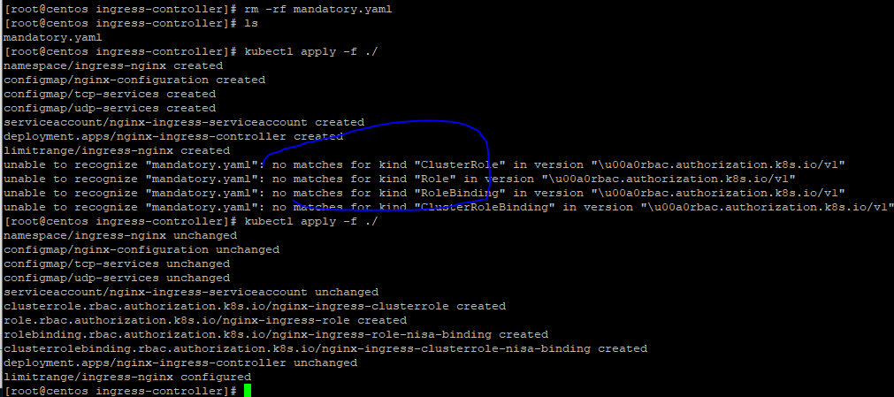

### 下载mandatory.yaml:

下载地址是：https://github.com/kubernetes/ingress-nginx/tree/nginx-0.30.0/deploy/static

1. 修改apiversion版本号
   将文件中的rbac.authorization.k8s.io/v1beta1 替换成 rbac.authorization.k8s.io/v1 原因是1.20版本已经v1beta1版本已经过期，所以最好是改成v1不然会告警或报错。
   quey.io 不用替换, 国内网络也可以下载此repo源
   下图报错是因为apiVersion： 后边有一个空格，语法错误，不允许   
   

```bash
[root@centos ingress-controller]# rm -rf mandatory.yaml
[root@centos ingress-controller]# ls
mandatory.yaml
[root@centos ingress-controller]# kubectl apply -f ./
namespace/ingress-nginx created
configmap/nginx-configuration created
configmap/tcp-services created
configmap/udp-services created
serviceaccount/nginx-ingress-serviceaccount created
deployment.apps/nginx-ingress-controller created
limitrange/ingress-nginx created
unable to recognize "mandatory.yaml": no matches for kind "ClusterRole" in version "\u00a0rbac.authorization.k8s.io/v1"
unable to recognize "mandatory.yaml": no matches for kind "Role" in version "\u00a0rbac.authorization.k8s.io/v1"
unable to recognize "mandatory.yaml": no matches for kind "RoleBinding" in version "\u00a0rbac.authorization.k8s.io/v1"
unable to recognize "mandatory.yaml": no matches for kind "ClusterRoleBinding" in version "\u00a0rbac.authorization.k8s.io/v1"
[root@centos ingress-controller]# kubectl apply -f ./
namespace/ingress-nginx unchanged
configmap/nginx-configuration unchanged
configmap/tcp-services unchanged
configmap/udp-services unchanged
serviceaccount/nginx-ingress-serviceaccount unchanged
clusterrole.rbac.authorization.k8s.io/nginx-ingress-clusterrole created
role.rbac.authorization.k8s.io/nginx-ingress-role created
rolebinding.rbac.authorization.k8s.io/nginx-ingress-role-nisa-binding created
clusterrolebinding.rbac.authorization.k8s.io/nginx-ingress-clusterrole-nisa-binding created
deployment.apps/nginx-ingress-controller unchanged
limitrange/ingress-nginx configured
[root@centos ingress-controller]#
```

2.
