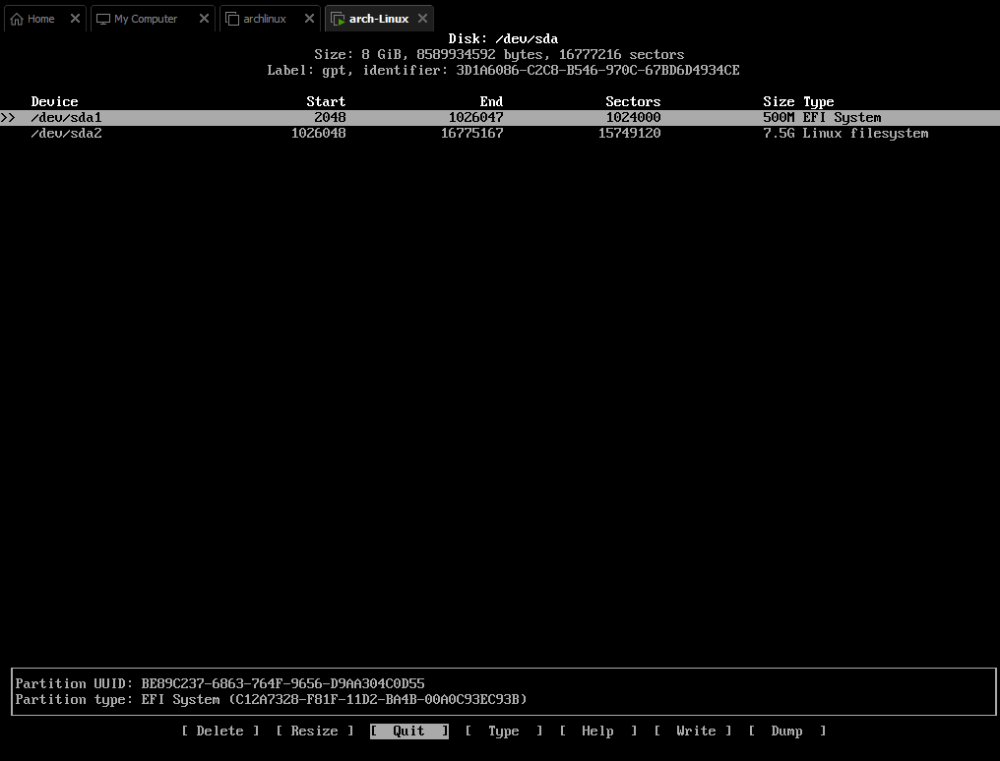
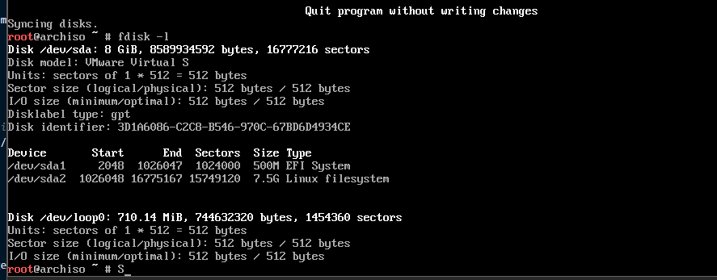
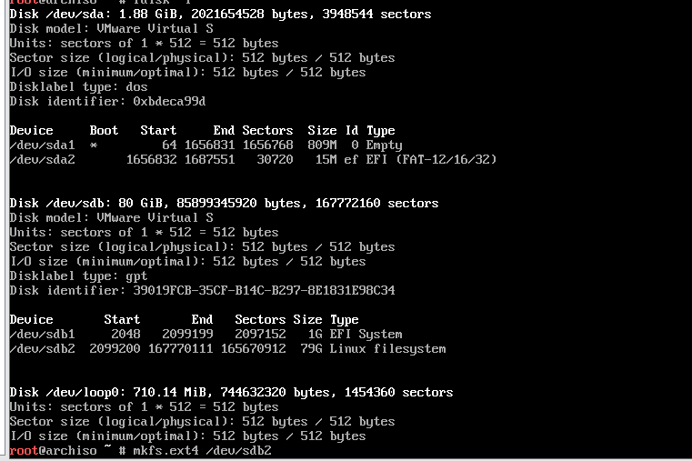

### 装
```bah
ping aidu.com
ping 8.8.8.8
timedatectl set-timezone Asia/Shanghai
date
fdisk -l #列出
cfdisk /dev/sda #我的硬盘是sda
```
或者cfdisk 回车，选择gpt  
本次一共20G大小


```bash
mkfs.vfat /dev/sda1    (boot分区必须使用fat32格式。efi分区)
mkfs.ext4 /dev/sda2    (/home分区,linux filesystem，最大的那个)


mount /dev/sda2 /mnt #挂载主分区 (sda2 is where I have root)
mount /dev/sda1 /mnt/boot (I do not use /mnt/boot/efi)
vim /etc/pacman.d/mirrorlist
Server = http://mirrors.tuna.tsinghua.edu.cn/archlinux/$repo/os/$arch
Server = http://mirrors.zju.edu.cn/archlinux/$repo/os/$arch 

pacman -Syy
pacman -Sy archlinux-keyring 
pacstrap /mnt efibootmgr grub base linux vim nano

mkdir /mnt/boot/efi
mount /dev/sda1 /mnt/boot/efi
genfstab -U /mnt >> /mnt/etc/fstab 

arch-chroot /mnt  #很重要！！ 已经安装过的archlinux 可以直接通过这个命令启动
ln -sf /usr/share/zoneinfo/Asia/Shanghai /etc/localtime  
hwclock --systohc 
pacman -Sy vim
> pacman -Qo locale-gen 
/usr/sbin/locale-gen is owned by glibc 2.38-5
> /usr/sbin/locale-gen
echo "LANG=en_US.UTF-8" > /etc/locale.conf
echo "archlinux" > /etc/hostname
pacman -S grub efibootmgr efivar networkmanager intel-ucode
grub-install /dev/sda
grub-mkconfig -o /boot/grub/grub.cfg
pacman -S openssh
systemctl enable sshd

pacman -Sy konsole plasma xorg
systemctl enable sddm
pacman -Sy wqy-zenhei
```



### 自动安装

### kde美化 开机后的配置
```bash
pacman -Sy konqueror
pacman -Syy inetutils # install telnet
pacman -Syy openssh # install openssh
pacman -S net-tools #install netstat
yes | sudo pacman -S firefox #without perceed with installation

vim /etc/hosts.allow 
# cat >>  为追加 cat > 为覆盖
cat >> /etc/pacman.conf << eof  
[archlinuxcn]
Server = https://mirrors.tuna.tsinghua.edu.cn/archlinuxcn/$arch
#Server = https://mirrors.aliyun.com/archlinuxcn/$arch
eof

systemctl start sshd #启动SSH服务：运行以下命令启动SSH服务：
systemctl enable sshd #设置SSH服务开机自启动：运行以下命令使SSH服务在系统启动时自动启动：
firewall-cmd --permanent --add-port=22/tcp #配置防火墙规则：如果您使用了防火墙，需要配置防火墙规SH连接。假设您使用的是firewalld，可以运行以下命令来开放22端口：
firewall-cmd --reload

# dhcp static ip
pacman -S dhcpcd
systemctl enable --now dhcpcd

cat >> /etc/dhcpcd.conf << eof
interface ens33
static ip_address=192.168.232.132/24
static routers=192.168.232.2  #gateway
static domain_name_servers=192.168.232.1 114.114.114.114
eof

cat >> /etc/resolv.conf << eof
nameserver 192.168.232.2
nameserver 114.114.114.114
eof 

#install chrome refered to: https://aur.archlinux.org/packages/google-chrome
$ curl -sSf https://dl.google.com/linux/chrome/deb/dists/stable/main/binary-amd64/Packages | \
     grep -A1 "Package: google-chrome-stable" | \
     awk '/Version/{print $2}' | \
     cut -d '-' -f1

```

### 性能查看
```bash
df -h #查看磁盘
free #查看memory
less /proc/meminfo #查看me
top -i #查看cpu
vmstat -s #or vmstat 回车，查看cpu + memory


```