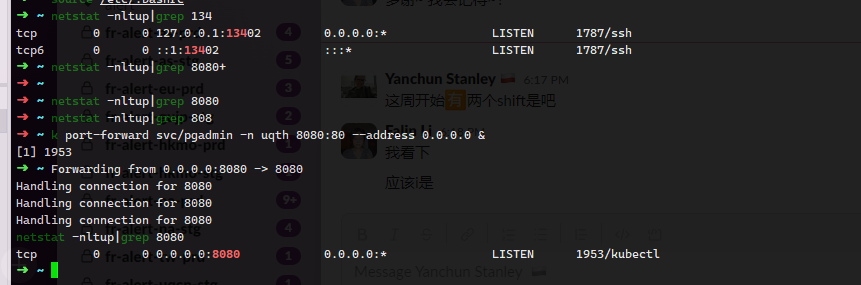

### 安装步骤
https://zhuanlan.zhihu.com/p/645064573  
对磁盘进行分区 选择默认分区    
软件选择 
- Debian默认环境
- GNOME
- SSH Server
- 标准系统工具


### 设置网卡重启
```bash
➜  ~ cat /etc/network/interfaces
# This file describes the network interfaces available on your system
# and how to activate them. For more information, see interfaces(5).

source /etc/network/interfaces.d/*

# The loopback network interface
auto lo
iface lo inet loopback
#开机自动激活eth0接口
auto ens33
#配置ens33接口为静态设置IP地址
iface ens33 inet static
address 192.168.232.100
netmask 255.255.255.0
network 192.168.232.0
broadcast 192.168.232.255
gateway 192.168.232.2

#设置完/etc/network/interfaces 之后 要重启服务 使之生效
systemctl restart networking.service
```


```bash
ping 8.8.8.8 #测试是否可以出网
ping baidu.com

echo "nameserver 192.168.232.2" >> /etc/resolv.conf 
echo "nameserver 8.8.8.8" >> /etc/resolv.conf 
echo "nameserver 8.8.4.4" >> /etc/resolv.conf 
echo "nameserver 114.114.114.114" >> /etc/resolv.conf 
echo "search localdomain" >> /etc/resolv.conf 
➜  ~ cat /etc/resolv.conf       
# Generated by NetworkManager
search localdomain
nameserver 192.168.232.2

grep -r google /etc/apt/sources.list.d
```

```bash
?  ~ netstat -nltup|grep 134
tcp        0      0 127.0.0.1:13402         0.0.0.0:*               LISTEN      1787/ssh            
tcp6       0      0 ::1:13402               :::*                    LISTEN      1787/ssh 
➜  ~ k port-forward svc/pgadmin -n uqth 8080:80 --address 0.0.0.0 &  #address允许任意主机访问
[1] 1953
netstat -nltup|grep 8080  #以下这个0.0.0.0 就是指 任何主机都可以访问这里的8080端口                                    
tcp        0      0 0.0.0.0:8080            0.0.0.0:*               LISTEN      1953/kubectl 


```

