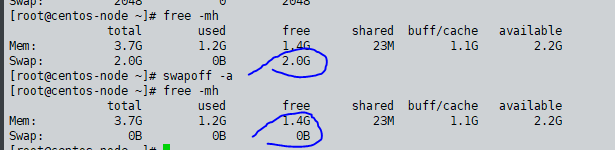

### selinux 相关配置
```bash
setenforce 0    #关闭selinux 临时关闭
cat /etc/selinxux/config  #修改 可以永久关闭

sestatus # 查看当前selinuxz状态  需要注意Current mode这个字段 
Current mode:                   permissive  #关闭的状态
Current mode:                   enforcing   #开启的状态

getenforce #c查看selinux 当前状态

systemctl stop firewalld 

```

### 文件操作：
```bash
grep -Ev '^$|#' xxx.conf #去掉空行和注释
cat -n xx.conf  #显示行号

ping 114.114.114.114
```


### 抓包命令：
```bash
tcpdump  -i deeptun0 host 192.168.2.142 -nvvvt


```

### 标准输入、
```bash
echo "hello" | xargs echo #xargs将

```


### 参数含义：
```bash
$0 
$n  # 当前脚本执行命令的第n个参数值，n = 1..9
$*  # $@ 和$* 类似，所有参数
$#  #当前脚本执行命令的输入参数个数，例如执行 ./test.sh aa bb cc ，则在 test.sh 里 $# 为 3
$!  # 上一个执行指令的PID（后台运行的最后一个进程的进程ID号）
$?  # 上一个命令返回的执行结果
$$  # 当前shell的PID（即脚本运行的当前进程号）
```


### 缓冲区：
```bash

free -m
free -mh
swapoff -a  #关闭缓冲区


```


### swap 交换区
https://www.bilibili.com/video/BV1kb41167cb
https://www.bilibili.com/video/BV1mV411Y7qn 
```bash
#1. 如何创建swap分区
fallocate -l 1G /swapfile   #创建交换文件
dd if=/dev/zero of=/swapfile bs=1M count=1024 # 最好用这个 不要用fallocate

chmod 600 /swapfile #给与读写权限
mkswap /swapfile   #格式化为swaf分区
swapon /swapfile #开启交换区

free -h #查看分配的交换区
swapon -s #检测是否已经关闭了交换区 没有任何输出就是关闭了
lsblk #也可以查看到是否使用了swap

#2. 交换区永久生效
vim /etc/fstab #添加如下信息 需要注释掉其他swap分区，避免重复使用swap情况
/swapfile        swap     swap    defaults    0     0

#3. 关闭交换区
swapoff -v /swapfile
swapoff -a
rm -rf /swapfile

#4. linux什么时候开始使用虚拟内存（swap)？ 
cat /proc/sys/vm/swappiness
60  #这个60代表物理内存在使用60%的时候才会使用swap

#更改使用swap空间的阈值
#linux虚拟内存的总量 = 物理内存（RAM) + swap(硬盘中)
sysctl vm.swappiness=10 #临时性修改：
cat /proc/sys/vm/swappiness
10

vim /etc/sysctl.conf  #永久性修改：
vm.swappiness = 35 # 加入参数  保存后/proc/sys/vm/swappiness 中的值也会生效
sysctl -p #查看是否生效：


```


### yum
```bash
# 查看已经安装的包
yum list installed |grep nginx 
rpm -qa nginx 


#卸载
rpm -e --nodeps XXX
rpm -qa|grep nginx|xargs rpm -e --nodeps

```