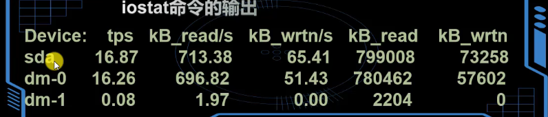
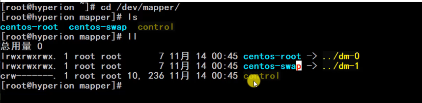
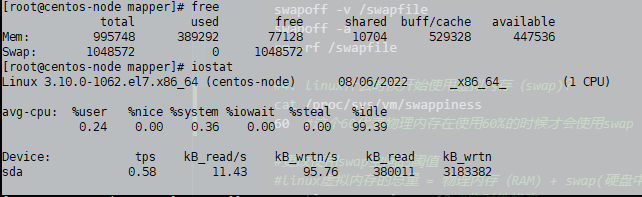
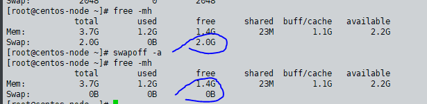
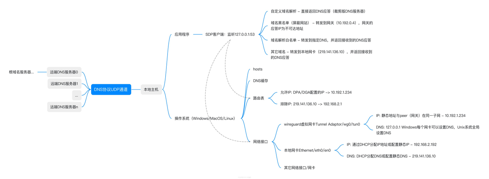

### selinux 相关配置
```bash
setenforce 0    #关闭selinux 临时关闭
cat /etc/selinxux/config  #修改 可以永久关闭

sestatus # 查看当前selinuxz状态  需要注意Current mode这个字段 
Current mode:                   permissive  #关闭的状态
Current mode:                   enforcing   #开启的状态

getenforce #c查看selinux 当前状态

systemctl stop firewalld 
#开放 10909 和 9876 端口
firewall-cmd --zone=public --add-port=10909/tcp --permanent
firewall-cmd --zone=public --add-port=9876/tcp --permanent
systemctl restart firewalld.service
firewall-cmd --reload
```


### 处理sudo -i 之后not a sudoers 
```bash
cp /etc/sudoers /etc/sudoers.original
vim /etc/sudoers 
# 再加一行
lifalin	ALL=(ALL:ALL) ALL 
#保存退出，就完成了

#第二种办法  绕开sudo 直接su root 输入账密即可
```

### vim 快捷键
```bash
yy #复制整行 
n #黏贴到下一行
```

### iptables, icmp:
```bash
yum install iptables-services #安装iptables 防火墙

cat /etc/sysconfig/iptables #只有安装了iptables 才有此文件

#禁止ping 防止ping攻击
echo "1" > /proc/sys/net/ipv4/icmp_echo_ignore_all

```

### 文件操作：
```bash
mv config.toml{,.bak} 

[root@centos ~]# type ls
ls is aliased to `ls --color=auto`

[root@centos ~]# alias ls
alias ls='ls --color=auto'

\ls  #直接使用ls命令
find / -name "*.log" -mtime 3 -exec rm -rf {} \; #最后创建时间是3天前，后缀是*log的文件并删
find / -name "*.log" -mtime 3 -ok rm -rf {} \;
find / -name "*.log" -mtime 3 | xargs rm -rf
grep -n "^$" file1  #查询file1里面空行所在行号
mkdir -p xunlei{1..20}/dir{1..255}/xunlei{1..10000}.html


grep -Ev '^$|#' xxx.conf #去掉空行和注释
cat -n xx.conf  #显示行号
cat a.txt B.txt >> demo.txt
cat > xx.txt << EOF  #覆盖写入
cat >> file.txt <<EOF   #追加写入
>SDFSDFSD
>EOF


ping 114.114.114.114
```


### 抓包命令：  	
```bash
tcpdump -i deeptun0 host 192.168.2.142 -nvvvt
tcpdump -i eth0 host 10.254.176.185 -nvvvt

```


### 监控：
```bash
dmesg |grep sda #是机器启动一闪而过的一堆命令和输出 缓存在ring buffer里边  也可以看到硬件连接和断开的信息
top #比较综合的命令
uptime #只显示top的第一尚
uptime -s #显示机器启动时间
free -s 1 #持续监视内存 1秒刷新一次


#http://t.zoukankan.com/yfacesclub-p-12015466.html 
#网卡使用情况
sar -n DEV
sar -n DEV -f /var/log/sa/saDD
sar -f /var/log/sa/saDD #DD表示数字，25表示25号，29表示29号
cat /proc/net/dev #监控网卡使用情况


#限制带宽 tc iptables cgroup 

```
注意：  
    若服务器丢包非常严重，需要查看网卡流量是否异常。接收数据部分 rxpck大于4000，或者rxKB大于5000，则有可能被攻击了，正常服务器网卡流量没有这么大。除非自己在拷贝数据。

### iostat io设备监控：

```bash
# 其实使用最多的是 网络nfs监控 + 本地磁盘的监控
# idle <20  要关注cpu le
# 如果io》30 算是比较大，但cpU挺闲 那么性能卡在io设备上
# https://www.bilibili.com/video/BV1rZ4y137Mo
iostat
iostat -N\
[root@centos-node personal]# iostat
Linux 3.10.0-1062.el7.x86_64 (centos-node) 	08/06/2022 	_x86_64_	(1 CPU)

avg-cpu:  %user   %nice %system %iowait  %steal   %idle
           0.25    0.00    0.34    0.00    0.00   99.40

Device:            tps    kB_read/s    kB_wrtn/s    kB_read    kB_wrtn
sda               0.40        11.66         1.17     365391      36813

cd /dev/mapper  #会有映射
```
此处只是视频中的操作：  

  
我自己本机不是这样的，即便是开启了swap分区：  



### 标准输入、
```bash
echo "hello" | xargs echo #xargs将
```


### 参数含义：
```bash
$0 
$n  # 当前脚本执行命令的第n个参数值，n = 1..9
$*  # $@ 和$* 类似，所有参数
$#  #当前脚本执行命令的输入参数个数，例如执行 ./test.sh aa bb cc ，则在 test.sh 里 $# 为 3
$!  # 上一个执行指令的PID（后台运行的最后一个进程的进程ID号）
$?  # 上一个命令返回的执行结果
$$  # 当前shell的PID（即脚本运行的当前进程号）
ll !$  # 将上一条命令的参数传递给下一条命令的参数，平时用于更方便，更多应用在bash脚本
OS=CentOS_7 #设置变量
echo $OS #设置变量

unset xxx yyy zzz #连续unset 

```


### 缓冲区：
```bash

free -m
free -mh
swapoff -a  #关闭缓冲区
sed -ri 's/.*swap.*/#&/' /etc/fstab #永久关闭


```


### swap 交换区
https://www.bilibili.com/video/BV1kb41167cb
https://www.bilibili.com/video/BV1mV411Y7qn 
```bash
#1. 如何创建swap分区
fallocate -l 1G /swapfile   #创建交换文件
dd if=/dev/zero of=/swapfile bs=1M count=1024 # 最好用这个 不要用fallocate

chmod 600 /swapfile #给与读写权限
mkswap /swapfile   #格式化为swaf分区
swapon /swapfile #开启交换区

free -h #查看分配的交换区
swapon -s #检测是否已经关闭了交换区 没有任何输出就是关闭了
lsblk #也可以查看到是否使用了swap

#2. 交换区永久生效
vim /etc/fstab #添加如下信息 需要注释掉其他swap分区，避免重复使用swap情况
/swapfile        swap     swap    defaults    0     0

#3. 关闭交换区
swapoff -v /swapfile
swapoff -a
rm -rf /swapfile

#4. linux什么时候开始使用虚拟内存（swap)？ 
cat /proc/sys/vm/swappiness
60  #这个60代表物理内存在使用60%的时候才会使用swap

#更改使用swap空间的阈值
#linux虚拟内存的总量 = 物理内存（RAM) + swap(硬盘中)
sysctl vm.swappiness=10 #临时性修改：
cat /proc/sys/vm/swappiness
10

vim /etc/sysctl.conf  #永久性修改：
vm.swappiness = 35 # 加入参数  保存后/proc/sys/vm/swappiness 中的值也会生效
sysctl -p #查看是否生效：


```
### mem一键清理？
```bash
free -m 查看
echo 1 > /proc/sys/vm/drop_caches #清理 
free -m  #查看  <https://blog.csdn.net/m0_67401055/article/details/123975789>

```


### 磁盘相关：
```bash

fdisk -l
[root@master01 yum.repos.d]# fdisk -l

Disk /dev/sda: 21.5 GB, 21474836480 bytes, 41943040 sectors
Units = sectors of 1 * 512 = 512 bytes
Sector size (logical/physical): 512 bytes / 512 bytes
I/O size (minimum/optimal): 512 bytes / 512 bytes
Disk label type: dos
Disk identifier: 0x000e5745

   Device Boot      Start         End      Blocks   Id  System
/dev/sda1   *        2048      616447      307200   83  Linux
/dev/sda2          616448     4810751     2097152   82  Linux swap / Solaris
/dev/sda3         4810752    41943039    18566144   83  Linux

```

### 网络相关：
```bash
nslookup -qt=ptr 74.125.128.106 #反向接卸
nslookup baidu.com 114.114.114.114 #也是指定ip访问

dig @114.114.114.114 baidu.com #用dig 指定域名解析  

host  baidu.com 

root@dnovik:~# host -t a prd-teamwork-uqde-identity.fastretailing.com
prd-teamwork-uqde-identity.fastretailing.com has address 35.241.33.3
root@dnovik:~# dig prd-teamwork-uqde-identity.fastretailing.com +short A
35.241.33.3

```


### dns解析顺序



### yum
```bash
# 查看已经安装的包
yum list installed |grep nginx 
rpm -qa nginx 


#卸载
rpm -e --nodeps XXX
rpm -qa|grep nginx|xargs rpm -e --nodeps

```

### cgroup:
```bash

ulimit -n #Linux能打开的最大文件描述符数量
cat /proc/sys/fs/file-max

#查看cgroup 版本
➜  ~ stat -fc %T /sys/fs/cgroup
cgroup2fs #表示版本是v2

df -hT
ll /sys/fs/cgroup
lssubsys
lssubsys -m 

#限制memory 的例子 https://www.bilibili.com/video/BV1XG4y1Y7wc
man cgcreate 
#创建一个memory 类型的cgroup 
cgcreate -a root -g memory:oomtest #-a <agid>:<auid>  -g <controllers>:<path>
lscgroup |grep oom #查看cgroup 找出
cgget -g memory:oomtest #查看创建的该组 或者是 cgget -g memory:/oomtest
ll /sys/fs/cgroup/memory/oomtest

echo 1000000 > /sys/fs/cgroup/memory/oomtest/memory.limit_in_bytes #

cgexec -g memory:oomtest mongod -f /etc/mongodb.conf #以刚创建的oomtest 启动mongodb, 此时fork了子进程 但立刻停止了, 因为才10M 根本跑不起来mongodb
ps -ef|grep mongo
dmesg -T|grep oom #可以查看到溢出的日志

lscgroup |grep oom #查看cgroup 找出
cgdelete memory:/oomtest #删除该创建的cgroup 


#限制cpu的例子 https://www.bilibili.com/video/BV1ei4y1S7dE
cgcreate -g cpu:friday
lscgroup |grep friday

cgset -r  cpu.cfs_quota_us=10000 friday  #set一下这个group 的时间
cgget -r cpu.cfs_quota_us friday  #get 查看
cgclassify -g cpu:friday 2750 #将进程加入该cgoup中 2750是进程号 此处是api-server 
cgclassify -g cpu:/ 2750  #取消限制


----------------------------------------------

[root@centos memory]# cgcreate -a root -g memory:oomtest
[root@centos memory]# ll |grep oom
-rw-r--r--   1 root root 0 Aug 13 02:08 memory.oom_control
drwxr-xr-x   2 root root 0 Aug 14 00:20 oomtest		

[root@centos ~]# lscgroup |grep oom 
memory:/oomtest

[root@master01 lifalin]# cd /sys/fs/cgroup
[root@master01 cgroup]# ll
total 0
drwxr-xr-x. 6 root root  0 Aug 13 02:14 blkio  
lrwxrwxrwx. 1 root root 11 Aug 13 02:14 cpu -> cpu,cpuacct
lrwxrwxrwx. 1 root root 11 Aug 13 02:14 cpuacct -> cpu,cpuacct
drwxr-xr-x. 6 root root  0 Aug 13 02:14 cpu,cpuacct
drwxr-xr-x. 3 root root  0 Aug 13 21:08 cpuset
drwxr-xr-x. 6 root root  0 Aug 13 02:14 devices
drwxr-xr-x. 3 root root  0 Aug 13 21:08 freezer
drwxr-xr-x. 3 root root  0 Aug 13 21:08 hugetlb
drwxr-xr-x. 6 root root  0 Aug 13 02:14 memory
lrwxrwxrwx. 1 root root 16 Aug 13 02:14 net_cls -> net_cls,net_prio
drwxr-xr-x. 3 root root  0 Aug 13 21:08 net_cls,net_prio
lrwxrwxrwx. 1 root root 16 Aug 13 02:14 net_prio -> net_cls,net_prio
drwxr-xr-x. 3 root root  0 Aug 13 21:08 perf_event
drwxr-xr-x. 6 root root  0 Aug 13 02:14 pids
drwxr-xr-x. 6 root root  0 Aug 13 02:14 systemd


[root@centos memory]# cgget -g cpu,cpuacct:/friday
/friday:
cpu.rt_period_us: 1000000
cpu.rt_runtime_us: 0
cpu.stat: nr_periods 0
	nr_throttled 0
	throttled_time 0
cpu.cfs_period_us: 100000 #10w ms
cpu.cfs_quota_us: -1  #指每10w ms 中该进程可以占用多少时间 -1 表示不限制，我们可以设置成10000
cpu.shares: 1024
cpuacct.stat: user 0
	system 0
cpuacct.usage_percpu: 0 0 
cpuacct.usage: 0

```


### linux 清理内存：
```bash
free -m  #查看
echo 1 > /proc/sys/vm/drop_caches #清理 
free -m 

```
### shell:
```bash
#linux shell(bash)测试表达式中“==“和“-eq“的区别 https://blog.csdn.net/wx_assa/article/details/103658351
# "=="是判断字符串是否相等。
# "-eq"是判断字符串对应的数字值是否相等。


#!/bin/bash
num1=123	#num1是长度为3的字符串
num2=0123	#num2是长度为4的字符串

if [ $num1 == $num2 ]   #no
if [ $num1 -eq $num2 ] #yes
if [ $num1 -eq $num2 -o 1 -eq 1 ] #or 条件

#字符串 比较 相等

#!/bin/bash
#program=$1
if [[ $program == java ]]; then
    echo "is java"
    kubectl patch logconfig -n $ns  log-$ns-$program  --patch-file  patch_java.yaml --type="merge"
fi

```
### linux中如何转换大小写
https://www.csdn.net/tags/Mtjagg5sNzY4MjQtYmxvZwO0O0OO0O0O.html
```bash
# 如果是单个文件，用
cat file | tr a-z A-Z > newfile
# 可以将文件内容转换为大写。
cat file | tr A-Z a-z > #newfile可以转换为小写。
# 也可以用
awk '{print toupper($1)}' file > newfile
```

### 监控 上下文切换
https://www.jianshu.com/p/3b499937055f
```bash
# 系统上下文切换
vmstat 5  # 每5s输出一组数据
pidstat -w 5 # 进程上下文切换
# 线程上下文切换
# 中断上下文切换

```