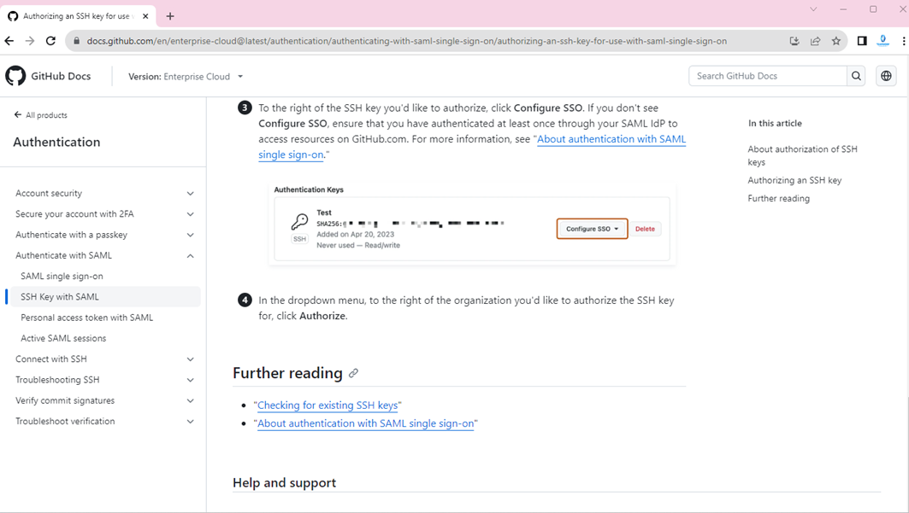
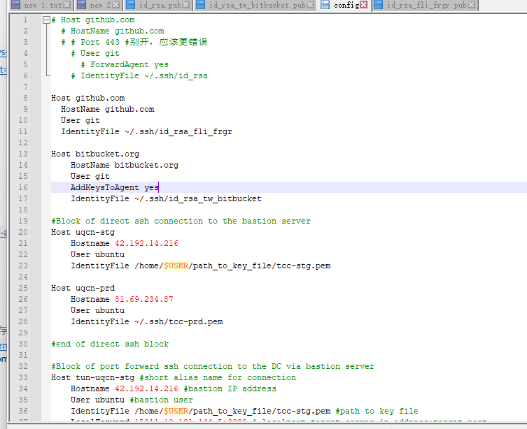

参考 https://blog.csdn.net/Sa883349/article/details/127815867

### 账号管理
```bash
ssh-keygen -t rsa -C "lifalin0802@hotmail.com"
# 在下面输入名字的时候，建议输入不一定的公司要名字，如id_rsa_xxxxxx
Generating public/private rsa key pair.
Enter file in which to save the key (/Users/zhaoliangchen/.ssh/id_rsa): id_rsa_xxxxxx
# 剩下的一直回车

ssh-add ~/.ssh/id_rsa #添加账号
ssh-add ~/.ssh/id_rsa_tw_bitbucket #个人账号，必须加上
ssh-add -l #添加后查看

ssh -T git@github.com
ssh -T git@bitbucket.org #1
git push origin master #falin_repos githu上的代码 push时候要关闭clash vpn


```

### how to solve: You‘ve successfully authenticated, but GitHub does not provide shell access
refered to: https://blog.csdn.net/weixin_44639164/article/details/128921508
```bash
git remote set-url origin git@github.com:用户名/仓库名.git
```
或者参考
https://docs.github.com/en/enterprise-cloud@latest/authentication/authenticating-with-saml-single-sign-on  
https://docs.github.com/en/enterprise-cloud@latest/authentication/authenticating-with-saml-single-sign-on/authorizing-an-ssh-key-for-use-with-saml-single-sign-on


### 多github账户如何配置
没有更好的办法，只能屏蔽其他的，使用当前的  
1-6行 和 9-11 行 是冲突的  


### git常用命令
```bash
git add --all .  #提交所有的修改之前做
git checkout .  #撤销所有未提交的修改

git add .
git commit -m "1" 
git checkout -b dev #切换到dev分支

git pull origin master #下载最新代码
git show --oneline -s #查看当前处于哪个commit
git log #查看当前分支所有log


#到bastion server 切换分支
git fetch
git checkout <branchname>

```

### ~/.ssh/config 配置文件内容
```bash
Host github.com
Hostname github.com
User git
IdentityFile ~/.ssh/id_rsa

Host bitbucket.org   #1 @后边的名字
Hostname bitbucket.org
User git
IdentityFile ~/.ssh/id_rsa_tw
```
