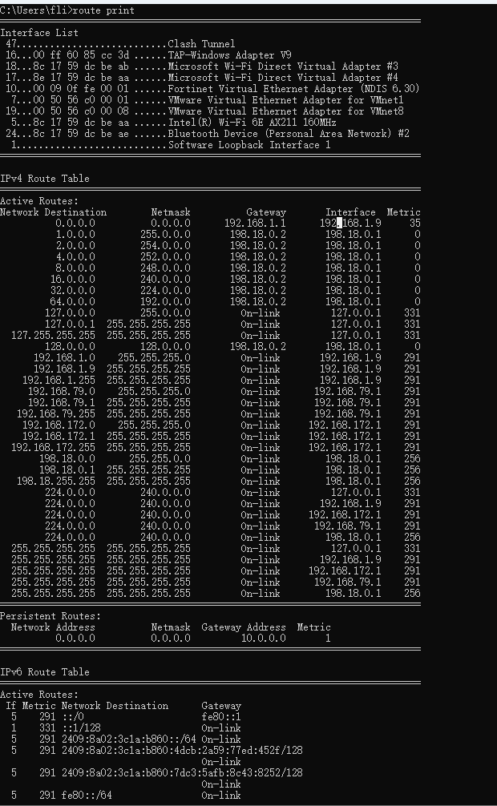

### teamwork 路由表 dns server  

```powershell
C:\Users\fli>ping sgp-uqas-backup-1

Pinging sgp-uqas-backup-1.RTW.com [198.18.1.127] with 32 bytes of data:
Reply from 198.18.1.127: bytes=32 time=7ms TTL=64
Reply from 198.18.1.127: bytes=32 time<1ms TTL=64

Ping statistics for 198.18.1.127:
    Packets: Sent = 2, Received = 2, Lost = 0 (0% loss),
Approximate round trip times in milli-seconds:
    Minimum = 0ms, Maximum = 7ms, Average = 3ms
Control-C
^C
C:\Users\fli>tracert 198.18.1.127

Tracing route to 198.18.1.127 over a maximum of 30 hops

  1    <1 ms    <1 ms    <1 ms  198.18.1.127

Trace complete.
C:\Users\fli>ping tky-backup-1

Pinging tky-backup-1.RTW.com [198.18.1.130] with 32 bytes of data:
Reply from 198.18.1.130: bytes=32 time<1ms TTL=64
Ping statistics for 198.18.1.130:
    Packets: Sent = 4, Received = 4, Lost = 0 (0% loss),
Approximate round trip times in milli-seconds:
    Minimum = 0ms, Maximum = 0ms, Average = 0ms

C:\Users\fli>nslookup tky-backup-1
Server:  UnKnown
Address:  198.18.0.2

Name:    tky-backup-1.RTW.com
Address:  198.18.1.130

C:\Users\fli>nslookup sgp-uqas-backup-1
Server:  UnKnown
Address:  198.18.0.2

Name:    sgp-uqas-backup-1.RTW.com
Address:  198.18.1.127

C:\Users\fli>ping tky-backup-1.RTW.com

Pinging tky-backup-1.RTW.com [198.18.1.130] with 32 bytes of data:
Reply from 198.18.1.130: bytes=32 time<1ms TTL=64

Ping statistics for 198.18.1.130:
    Packets: Sent = 1, Received = 1, Lost = 0 (0% loss),
Approximate round trip times in milli-seconds:
    Minimum = 0ms, Maximum = 0ms, Average = 0ms
Control-C
^C
C:\Users\fli>nslookup baidu.com
Server:  UnKnown
Address:  198.18.0.2

Name:    baidu.com.RTW.com
Address:  198.18.1.181

```

```bash
route print # 查看本地路由表， 这个是teamwork windows笔记本的，估计是电脑刚拿来装机时候同步策略就同步下来的
```



```sql
--remove db from AG
use master
alter availability group [uqde-stg-1b-ag]
remove database CloudHQ_UQDE
go

ALTER DATABASE CloudHQ_UQDE SET MULTI_USER;
```