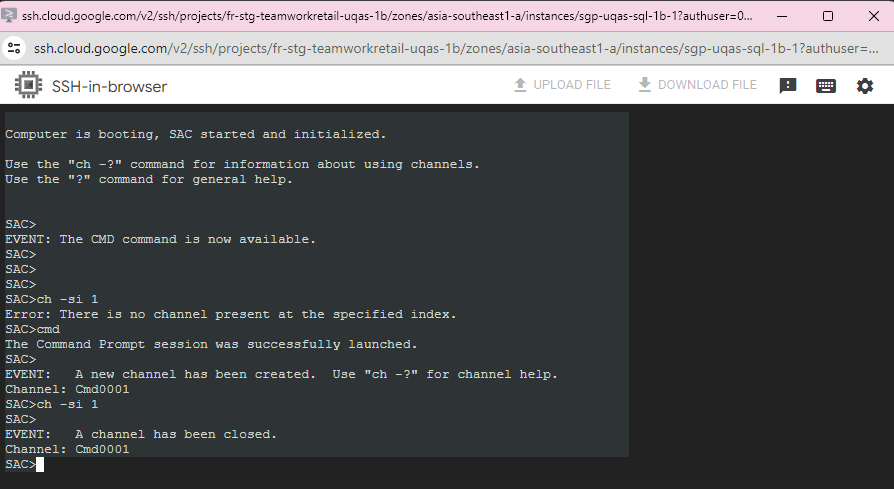
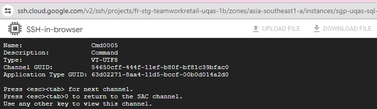
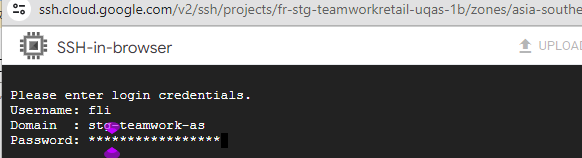
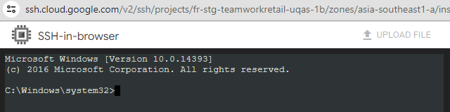
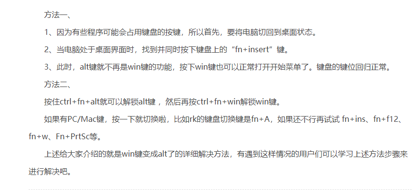

### windows下安装 kubectl
```bash
curl.exe -LO "https://dl.k8s.io/release/v1.27.1/bin/windows/amd64/kubectl.exe"


# win11右键show more options怎么关闭
#打开注册表 导航到此路
HKEY_CURRENT_USER\SOFTWARE\CLASSES\CLSID
右键单击CLSID并选择“新建”》“项”，然后将其命名为：{86ca1aa0-34aa-4e8b-a509-50c905bae2a2}。

```
#### enable disk online
```bash
diskpart # hit enter

list disk
select disk 0 or 1
online or offline disk
```

### Check which folder used in network in windows ( at backup server)
```powershell
wmic share get Name,Path
```


### Install telnet in windows server
```powershell
dism /online /Enable-Feature /FeatureName:TelnetClient
```


```cmd

C:\Users\fli>dsquery computer |findstr uqas
"CN=uqas-stg-1d-clu,OU=STG 1D,OU=Servers,DC=stg-teamwork-as,DC=fastretailing,DC=com"
"CN=uqas-stg-2d-clu,OU=STG 2D,OU=Servers,DC=stg-teamwork-as,DC=fastretailing,DC=com"
"CN=uqas-stg-1a-clu,OU=STG 1A,OU=Servers,DC=stg-teamwork-as,DC=fastretailing,DC=com"
"CN=uqas-stg-2a-clu,OU=STG 2A,OU=Servers,DC=stg-teamwork-as,DC=fastretailing,DC=com"
"CN=uqas-stg-2b-clu,CN=Computers,DC=stg-teamwork-as,DC=fastretailing,DC=com"
"CN=uqas-stg-2b-sql,CN=Computers,DC=stg-teamwork-as,DC=fastretailing,DC=com"
"CN=uqas-stg-1b-clu,CN=Computers,DC=stg-teamwork-as,DC=fastretailing,DC=com"
```

```powershell
[Net.ServicePointManager]::SecurityProtocol = [Net.SecurityProtocolType]::Tls12
Install-Module -Name SqlServer -AllowClobber -Force

Get-Module -ListAvailable SqlServer

$env:PSModulePath = $env:PSModulePath + ";C:\Program Files\WindowsPowerShell\Modules\SqlServer\22.3.0"

```

### how to use serial console once windows VM cannot be connected
```sh
cmd
ch -si 1
cmd  #此处会让输入username password domain  
powershell
```

此处enter 回车  




win键和alt键互换了怎么换回来



```powershell
netsh advfirewall firewall add rule name="Open RDP" dir=in action=allow protocol=TCP localport=3389 
Set-ItemProperty -Path 'HKLM:\SYSTEM\CurrentControlSet\Control\Terminal Server\' -Name "fDenyTSConnections" -Value 0
Restart-Service -Name TermService -Force

netsh interface ipv4 delete address "Ethernet" addr=10.167.120.49
netsh interface ipv4 show interfaces
netsh interface ipv4 set address "Ethernet" addr=10.167.120.50 mask=255.255.255.240 gateway=10.167.120.49
netsh interface ipv4 set address "Ethernet" gateway=10.167.120.49	
netsh interface ipv4 show addresses

$PSVersionTable.PSVersion

Get-WmiObject Win32_NetworkAdapter | Format-Table Index, NetConnectionID
 
RDP 闪退 + 3389正常 + gateway 正常+ 能ping通任何设备 = > 只能重启机器
```