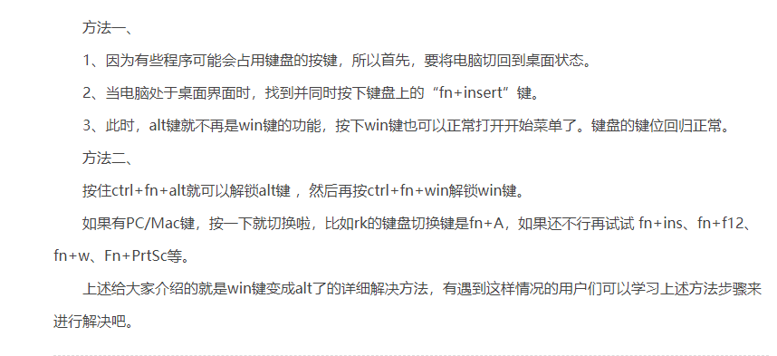

### windows下安装 kubectl
```bash
curl.exe -LO "https://dl.k8s.io/release/v1.27.1/bin/windows/amd64/kubectl.exe"


# win11右键show more options怎么关闭
#打开注册表 导航到此路
HKEY_CURRENT_USER\SOFTWARE\CLASSES\CLSID
右键单击CLSID并选择“新建”》“项”，然后将其命名为：{86ca1aa0-34aa-4e8b-a509-50c905bae2a2}。

```
#### enable disk online
```bash
diskpart # hit enter
disk list
lisk disk
select disk 0 or 1
online or offline disk
```

win键和alt键互换了怎么换回来
